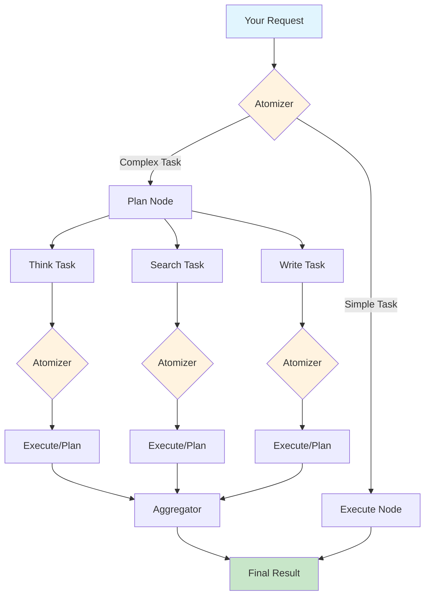

<div align="center">

<h1>🧠 SentientResearchAgent</h1>

<p align="center">
  <strong>Build ANY hierarchical AI agent with just three building blocks: Think, Write, and Search</strong>
</p>

<p align="center">
  <a href="https://github.com/salzubi401/SentientResearchAgent/releases">
    
  </a>
  <a href="https://github.com/salzubi401/SentientResearchAgent/blob/main/LICENSE">
    
  </a>
  <a href="https://www.python.org/downloads/">
    
  </a>
  <a href="https://pdm-project.org">
    
  </a>
  <a href="https://github.com/salzubi401/SentientResearchAgent/stargazers">
    
  </a>
  <a href="https://github.com/salzubi401/SentientResearchAgent/network/members">
    
  </a>
</p>

<p align="center">
  <a href="#-quick-start">Quick Start</a> •
  <a href="#-features">Features</a> •
  <a href="#-examples">Examples</a> •
  <a href="docs/">Documentation</a> •
  <a href="#-community">Community</a> •
  <a href="CONTRIBUTING.md">Contributing</a>
</p>

</div>

---

## 🎯 What is SentientResearchAgent?

SentientResearchAgent is a **general-purpose hierarchical task execution framework** that decomposes complex tasks using the MECE (Mutually Exclusive, Collectively Exhaustive) principle. Whether you're building a podcast generator, market analyzer, or code reviewer—if you can think of it in terms of **Think 🤔**, **Write ✍️**, and **Search 🔍** operations, you can build it here.

### 🚀 30-Second Quick Start

```bash
# Install
pip install sentientresearchagent  # Coming soon to PyPI

# Or from source
git clone https://github.com/salzubi401/SentientResearchAgent.git
cd SentientResearchAgent
./setup.sh  # Automated setup with Docker or native installation
```

```python
# Your first agent in 3 lines
from sentientresearchagent import SentientAgent

agent = SentientAgent.create()
result = await agent.run("Create a podcast about AI safety")
```

## ✨ Features

<table>
<tr>
<td width="50%">

### 🔄 **Recursive Task Decomposition**
Automatically breaks down complex tasks into manageable subtasks with intelligent dependency management

</td>
<td width="50%">

### 🤖 **LLM Agnostic**
Works with any LLM provider (OpenAI, Anthropic, Google, local models) through unified interface

</td>
</tr>
<tr>
<td width="50%">

### 🔍 **Complete Transparency**
Stage tracing shows exactly what happens at each step - debug and optimize with full visibility

</td>
<td width="50%">

### 👥 **Human-in-the-Loop**
Review and modify plans before execution with configurable intervention points

</td>
</tr>
</table>

## 🏗️ How It Works



The framework uses three fundamental operations that can be recursively combined:

- **🤔 THINK** - Reasoning, analysis, and decision making
- **✍️ WRITE** - Content generation and synthesis
- **🔍 SEARCH** - Information retrieval and research

## 📊 Example Applications

<details>
<summary><b>🎙️ Podcast Generator</b></summary>

```python
agent = SentientAgent.create()
podcast = await agent.run("""
    Create a 10-minute podcast episode about renewable energy.
    Include intro, 3 segments, and outro with timestamps.
""")
```

**Output**: Complete script with host dialogue, research citations, timestamps, and show notes.
</details>

<details>
<summary><b>📈 Market Analyzer</b></summary>

```python
agent = ProfiledSentientAgent.create_with_profile("market_analysis")
analysis = await agent.run("""
    Analyze the current state of the EV market and predict 
    trends for the next 5 years.
""")
```

**Output**: Comprehensive market report with data visualizations, competitor analysis, and trend predictions.
</details>

<details>
<summary><b>📝 Content Creator</b></summary>

```python
agent = SentientAgent.create()
content = await agent.run("""
    Write a viral LinkedIn post about remote work productivity tips.
    Make it engaging and include relevant statistics.
""")
```

**Output**: Optimized post with hooks, statistics, hashtags, and engagement strategies.
</details>

## 🛠️ Installation

### Prerequisites

- Python 3.12+
- Node.js 18+ (for web interface)
- Docker (optional, for containerized setup)

### Option 1: Quick Setup (Recommended)

```bash
curl -sSL https://raw.githubusercontent.com/salzubi401/SentientResearchAgent/main/setup.sh | bash
```

### Option 2: Manual Installation

<details>
<summary>Click to expand manual installation steps</summary>

```bash
# Clone repository
git clone https://github.com/salzubi401/SentientResearchAgent.git
cd SentientResearchAgent

# Setup Python environment
pip install pdm
pdm install

# Setup frontend (optional)
cd frontend
npm install
cd ..

# Configure environment
cp .env.example .env
# Edit .env with your API keys

# Start the server
python -m sentientresearchagent
```

</details>

### Option 3: Docker

```bash
docker run -p 5000:5000 -p 5173:5173 \
  -e OPENROUTER_API_KEY=your_key \
  sentient/research-agent:latest
```

## 📖 Documentation

| Document | Description |
|----------|-------------|
| [🚀 Introduction](docs/INTRODUCTION.md) | Understand the vision and architecture |
| [🍳 Quick Start Cookbook](docs/QUICKSTART_COOKBOOK.md) | Ready-to-use agent recipes |
| [🧠 Core Concepts](docs/CORE_CONCEPTS.md) | Master the MECE framework |
| [🤖 Agents Guide](docs/AGENTS_GUIDE.md) | Create custom agents |
| [⚙️ Configuration](docs/CONFIGURATION.md) | Detailed configuration options |
| [📚 API Reference](docs/API.md) | Complete API documentation |

## 🌟 Why SentientResearchAgent?

<table>
<tr>
<th>Traditional AI Tools</th>
<th>SentientResearchAgent</th>
</tr>
<tr>
<td>❌ Single-purpose tools</td>
<td>✅ Universal framework for any task</td>
</tr>
<tr>
<td>❌ Black box operation</td>
<td>✅ Complete transparency with stage tracing</td>
</tr>
<tr>
<td>❌ Limited to simple queries</td>
<td>✅ Handles complex multi-step workflows</td>
</tr>
<tr>
<td>❌ Vendor lock-in</td>
<td>✅ Works with any LLM provider</td>
</tr>
<tr>
<td>❌ No human oversight</td>
<td>✅ Built-in human-in-the-loop</td>
</tr>
</table>

## 🤝 Community

Join our growing community of agent builders!

- 💬 [Discord](https://discord.gg/sentientagent) - Get help and share ideas
- 📢 [Twitter](https://twitter.com/sentientagent) - Latest updates
- 🎯 [Roadmap](https://github.com/salzubi401/SentientResearchAgent/projects) - See what's coming

### 🏆 Community Showcase

Check out amazing agents built by our community:
- [Awesome SentientAgent](https://github.com/community/awesome-sentientagent) - Curated list of agents
- [Agent Marketplace](https://sentientagent.xyz/marketplace) - Share and discover agents

## 👥 Contributors

<a href="https://github.com/salzubi401/SentientResearchAgent/graphs/contributors">
  
</a>

## 📄 License

This project is licensed under the MIT License - see the [LICENSE](LICENSE) file for details.

## 🙏 Acknowledgments

Inspired by the hierarchical planning approach described in ["Beyond Outlining: Heterogeneous Recursive Planning"](https://arxiv.org/abs/2503.08275) by Xiong et al.

## 📚 Citation

If you use SentientResearchAgent in your research, please cite:

```bibtex
@software{sentientresearchagent2024,
  title = {SentientResearchAgent: A Hierarchical AI Agent Framework},
  author = {Al-Zubi, Salah},
  year = {2024},
  url = {https://github.com/salzubi401/SentientResearchAgent}
}
```

---

<div align="center">
  <p>
    <b>Build something amazing today!</b><br>
    If you can think it, you can build it with Think, Write, and Search 🚀
  </p>
  
  <a href="https://github.com/salzubi401/SentientResearchAgent">
    
  </a>
</div>