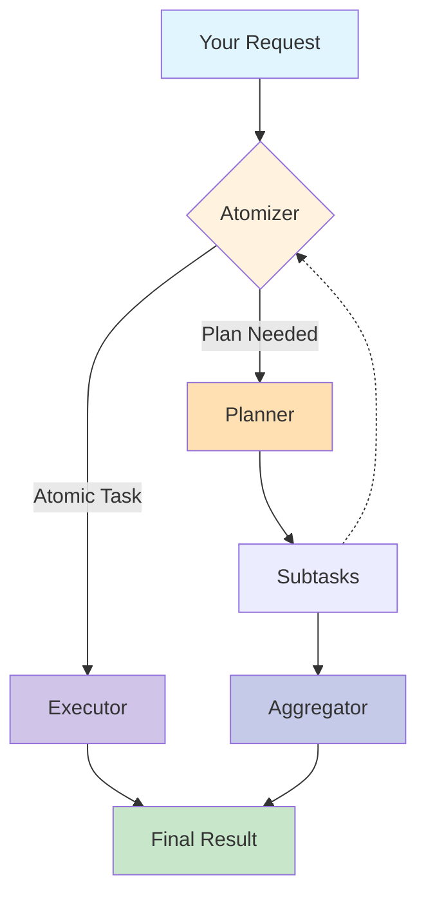

<div align="center">
<div align="center">
    
</div>
<h1>ROMA: Recursive Open Meta-Agents</h1>

<p align="center">
  <strong>Building hierarchical high-performance multi-agent systems made easy! </strong>
</p>


<p align="center">
  <a href="https://github.com/salzubi401/SentientResearchAgent/releases">
    
  </a>
  <a href="https://github.com/salzubi401/SentientResearchAgent/blob/main/LICENSE">
    
  </a>
  <a href="https://www.python.org/downloads/">
    
  </a>
  <a href="https://pdm-project.org">
    
  </a>
  <a href="https://github.com/salzubi401/SentientResearchAgent/stargazers">
    
  </a>
  <a href="https://github.com/salzubi401/SentientResearchAgent/network/members">
    
  </a>
</p>

<p align="center">
  <a href="#-quick-start">Quick Start</a> •
  <a href="#-features">Features</a> •
  <a href="#-examples">Examples</a> •
  <a href="docs/">Documentation</a> •
  <a href="#-community">Community</a> •
  <a href="CONTRIBUTING.md">Contributing</a>
</p>

</div>

---

## 📖 Documentation


### Getting Started
- **[🚀 Introduction](docs/INTRODUCTION.md)** - Understand the vision and architecture behind ROMA

### Core Framework
- **[🧠 Core Concepts](docs/CORE_CONCEPTS.md)** - Master the MECE framework and hierarchical task decomposition
- **[🤖 Agents Guide](docs/AGENTS_GUIDE.md)** - Learn how to create and customize your own agents

- **[⚙️ Configuration](docs/CONFIGURATION.md)** - Detailed configuration options and environment setup

## 🎯 What is ROMA?

**ROMA** is a **meta-agent framework** that uses recursive hierarchical structures to solve complex problems. By breaking down tasks into parallelizable components, ROMA enables agents to tackle sophisticated reasoning challenges while maintaining transparency that makes context-engineering and iteration straightforward. The framework offers **parallel problem solving** where agents work simultaneously on different parts of complex tasks, **transparent development** with a clear structure for easy debugging, and **proven performance** demonstrated through our search agent's strong benchmark results. We've shown the framework's effectiveness, but this is just the beginning. As an **open-source and extensible** platform, ROMA is designed for community-driven development, allowing you to build and customize agents for your specific needs while benefiting from the collective improvements of the community.

## 🏗️ How It Works


**ROMA** framework processes tasks through a recursive **plan–execute loop**:

```python
def solve(task):
    if is_atomic(task):                 # Step 1: Atomizer
        return execute(task)            # Step 2: Executor
    else:
        subtasks = plan(task)           # Step 2: Planner
        results = []
        for subtask in subtasks:
            results.append(solve(subtask))  # Recursive call
        return aggregate(results)       # Step 3: Aggregator

# Entry point:
answer = solve(initial_request)
```
1. **Atomizer** – Decides whether a request is **atomic** (directly executable) or requires **planning**.  
2. **Planner** – If planning is needed, the task is broken into smaller **subtasks**. Each subtask is fed back into the **Atomizer**, making the process recursive.  
3. **Executors** – Handle atomic tasks. Executors can be **LLMs, APIs, or even other agents** — as long as they implement an `agent.execute()` interface.  
4. **Aggregator** – Collects and integrates results from subtasks. Importantly, the Aggregator produces the **answer to the original parent task**, not just raw child outputs.  


#### 📐 Information Flow  
- **Top-down:** Tasks are decomposed into subtasks recursively.  
- **Bottom-up:** Subtask results are aggregated upwards into solutions for parent tasks.  
- **Left-to-right:** If a subtask depends on the output of a previous one, it waits until that subtask completes before execution.  

This structure makes the system flexible, recursive, and dependency-aware — capable of decomposing complex problems into smaller steps while ensuring results are integrated coherently. 

<details>
<summary>Click to view the system flow diagram</summary>



</details><br>

### 🚀 30-Second Quick Start

```bash
# Install
pip install sentientresearchagent  # Coming soon to PyPI

# Or from source
git clone https://github.com/salzubi401/SentientResearchAgent.git
cd SentientResearchAgent

# Run the automated setup
./setup.sh
```

Choose between:
- **Docker Setup** (Recommended) - One-command setup with isolation
- **Native Setup** - Direct installation for development

### 🏗️ Optional: E2B Sandbox Integration

For secure code execution capabilities, optionally set up E2B sandboxes:

```bash
# After main setup, configure E2B (requires E2B_API_KEY and AWS credentials in .env)
./setup.sh --e2b

# Test E2B integration
./setup.sh --test-e2b
```

**E2B Features:**
- 🔒 **Secure Code Execution** - Run untrusted code in isolated sandboxes
- ☁️ **S3 Integration** - Automatic data sync between local and sandbox environments  
- 🚀 **goofys Mounting** - High-performance S3 filesystem mounting
- 🔧 **AWS Credentials** - Passed securely via Docker build arguments

### 💾 S3 Data Persistence

SentientResearchAgent includes a comprehensive S3 mounting solution for seamless data persistence across all environments:

```bash
# During setup, you'll be asked:
# "Setup S3 mounting for data persistence? (y/n)"

# Universal mount directory: /opt/sentient (identical across all platforms)
```

**🔒 Enterprise-Grade Security Features:**
- 🛡️ **Path Injection Protection** - Validated mount directories prevent security vulnerabilities
- 🔐 **AWS Credentials Validation** - Pre-flight checks ensure S3 bucket access before mounting
- 📁 **Safe Environment Parsing** - Secure handling of configuration files and environment variables
- 🔍 **Mount Verification** - Comprehensive testing of mount functionality before proceeding
- ⚡ **FUSE Dependency Checking** - Automatic verification of macFUSE/FUSE requirements

**🚀 Advanced Mounting Capabilities:**
- 🔄 **Exact Path Matching** - Identical mount paths across local, Docker, and E2B environments
- ⚡ **Zero-Sync Latency** - Live filesystem access via high-performance goofys mounting
- 📁 **Dynamic Project Isolation** - Runtime project-based folders with configurable structures
- 🛠 **Cross-Platform Support** - Seamless operation on macOS and Linux with auto-installation
- 🔐 **Persistent Services** - Auto-mount on boot via systemd/launchd with proper configuration
- 🔧 **Flexible Configuration** - Boolean values accept multiple formats (true/yes/1/on/enabled)

**🏗️ Architecture Benefits:**
1. **Unified Data Layer**: All environments access the exact same S3-mounted directory
2. **No Path Translation**: Eliminates complexity with consistent `${S3_MOUNT_DIR}` across all systems
3. **Instant Availability**: Files written by data toolkits appear immediately in E2B sandboxes
4. **Secure Docker Integration**: Dynamic compose file selection with validated mount paths
5. **Production-Ready**: Enterprise security validation with comprehensive error handling

**How It Works:**
```bash
# Local System: Data toolkit saves to
${S3_MOUNT_DIR}/project_123/binance/price_data_1642567890.parquet

# Docker Container: Exact same path
${S3_MOUNT_DIR}/project_123/binance/price_data_1642567890.parquet  

# E2B Sandbox: Identical path structure
${S3_MOUNT_DIR}/project_123/binance/price_data_1642567890.parquet
```

Make sure that S3_MOUNT_DIR is universal across all platform as absolute path so the path of the files would be consistent.

**Perfect data consistency with zero configuration overhead!**

### 🐳 Docker S3 mounting with goofys (setup.sh pipeline)

When you run `./setup.sh` and choose Docker, the script:

1. Validates `S3_MOUNT_ENABLED` and `S3_MOUNT_DIR` from your `.env`.
2. If enabled and valid, starts Compose with `docker/docker-compose.yml` plus the S3 override `docker/docker-compose.s3.yml`.
3. The override grants FUSE permissions (`/dev/fuse`, `SYS_ADMIN`, apparmor unconfined) required for `goofys` inside the container.
4. The backend container entrypoint runs `/usr/local/bin/startup.sh`, which mounts S3 using `goofys` before launching the app.

macOS note (Docker mode): Docker Desktop does not support FUSE mounts inside containers. Our setup mounts S3 on the host at the universal path (`/opt/sentient`) and bind-mounts it into the container. The container startup detects the existing mount and verifies it maps to the intended bucket, skipping in-container goofys. On Linux Docker engines, the container can mount directly.

Pass additional `goofys` flags via the environment variable `GOOFYS_EXTRA_ARGS` in your `.env`:

```bash
# .env
S3_MOUNT_ENABLED=true
S3_MOUNT_DIR=/opt/sentient
S3_BUCKET_NAME=your-s3-bucket
AWS_ACCESS_KEY_ID=your_key
AWS_SECRET_ACCESS_KEY=your_secret
AWS_REGION=us-east-1

# Optional: extra goofys flags
GOOFYS_EXTRA_ARGS="--allow-other --stat-cache-ttl=10s --type-cache-ttl=10s"
```

Notes:
- All variables from `.env` are injected into the backend container by Compose and read by `startup.sh`.
- The command specified in the image (`uv run python -m sentientresearchagent`) is forwarded unchanged by `startup.sh` via `exec "$@"`.

### Your First Agent in 5 Minutes
./setup.sh  # Automated setup with Docker or native installation
```

```python
# Your first agent in 3 lines
from sentientresearchagent import SentientAgent

agent = SentientAgent.create()
result = await agent.run("Create a podcast about AI safety")
```

## ✨ Features

<table>
<tr>
<td width="50%">

### 🔄 **Recursive Task Decomposition**
Automatically breaks down complex tasks into manageable subtasks with intelligent dependency management. Runs independent sub-tasks in **parallel**.

</td>
<td width="50%">

### 🤖 **Agent Agnostic**
Works with any provider (OpenAI, Anthropic, Google, local models) through unified interface, as long as it has an `agent.run()` command, then you can use it!

</td>
</tr>
<tr>
<td width="50%">

### 🔍 **Complete Transparency**
Stage tracing shows exactly what happens at each step - debug and optimize with full visibility

</td>
<td width="50%">

### 🔌 Connect Any Tool

Seamlessly integrate external tools and protocols with configurable intervention points. Already includes production-grade connectors such as E2B, file-read-write, and more.

</td>
</tr>
</table>


## 👥 Contributors

Salaheddin Alzu'bi -- Project Lead & Core Contributor

Baran Nama -- Core Contributor

Arda Kaz -- Core Contributor

Sewoong Oh -- Research Oversight


## 🙏 Acknowledgments

This framework would not have been possible if it wasn't for these amazing open-source contributions!
- Inspired by the hierarchical planning approach described in ["Beyond Outlining: Heterogeneous Recursive Planning"](https://arxiv.org/abs/2503.08275) by Xiong et al.
- [Pydantic](https://github.com/pydantic/pydantic) - Data validation using Python type annotations
- [Agno](https://github.com/agno-ai/agno) - Framework for building AI agents
- [E2B](https://github.com/e2b-dev/e2b) - Cloud runtime for AI agents

## 📚 Citation

If you use SentientResearchAgent in your research, please cite:

```bibtex
@misc{xiong2025heterogeneousrecursiveplanning,
      title={Beyond Outlining: Heterogeneous Recursive Planning for Long-form Writing with Language Models}, 
      author={Ruibin Xiong and Yimeng Chen and Dmitrii Khizbullin and Mingchen Zhuge and Jürgen Schmidhuber},
      year={2025},
      eprint={2503.08275},
      archivePrefix={arXiv},
      primaryClass={cs.AI},
      url={https://arxiv.org/abs/2503.08275}
}
```

Special thanks to the WriteHERE project for pioneering the hierarchical approach to AI task planning.

## 🛠️ Technical Stack

- **Framework**: Built on [AgnoAgents](https://github.com/your/agnoagents)
- **Backend**: Python 3.12+ with FastAPI/Flask
- **Frontend**: React + TypeScript with real-time WebSocket
- **LLM Support**: Any provider via LiteLLM
- **Data Persistence**: Enterprise S3 mounting with security validation
  - 🔒 **goofys FUSE mounting** for zero-latency file access
  - 🛡️ **Path injection protection** with comprehensive validation
  - 🔐 **AWS credentials verification** before operations
  - 📁 **Dynamic Docker Compose** with secure volume mounting
- **Code Execution**: E2B sandboxes with unified S3 integration
- **Security**: Production-grade validation and error handling
- **Features**: Multi-modal, tools, MCP, hooks, caching

## 📦 Installation Options

### Quick Start (Recommended)
```bash
# Main setup (choose Docker or Native)
./setup.sh

# Optional: Setup E2B sandbox integration
./setup.sh --e2b

# Test E2B integration  
./setup.sh --test-e2b
```

### Command Line Options
```bash
./setup.sh --docker     # Run Docker setup directly
./setup.sh --docker-from-scratch  # Rebuild Docker images/containers from scratch (down -v, no cache)
./setup.sh --native     # Run native setup directly (macOS/Ubuntu/Debian)
./setup.sh --e2b        # Setup E2B template (requires E2B_API_KEY + AWS creds)
./setup.sh --test-e2b   # Test E2B template integration
./setup.sh --help       # Show all available options
```

### Manual Installation
See [docs/SETUP.md](docs/SETUP.md) for detailed instructions.

### Configuration
1. Copy `.env.example` to `.env`
2. Add your LLM API keys
3. **Optional**: Configure comprehensive S3 mounting:
   ```bash
   # ===== S3 Mounting Configuration =====
   # Enable S3 mounting (accepts: true/yes/1/on/enabled)
   S3_MOUNT_ENABLED=true
   
   # Universal mount directory (identical across all platforms)
   S3_MOUNT_DIR=/opt/sentient
   
   # AWS S3 Configuration
   S3_BUCKET_NAME=your-s3-bucket
   AWS_ACCESS_KEY_ID=your_aws_key
   AWS_SECRET_ACCESS_KEY=your_aws_secret
   AWS_REGION=us-east-1
   
   # ===== E2B Integration (Optional) =====
   E2B_API_KEY=your_e2b_api_key_here
   ```
4. Customize `sentient.yaml` as needed

**🔒 Security Features in Configuration:**
- **Path validation**: Mount directories are validated against injection attacks
- **AWS verification**: Credentials are tested before mounting attempts
- **FUSE checking**: System dependencies verified automatically
- **Mount verification**: Comprehensive functionality testing before proceeding
- **Flexible booleans**: `S3_MOUNT_ENABLED` accepts multiple true/false formats

## 🤝 Contributing

We welcome contributions! Whether it's:
- New agent templates
- Use case examples
- Documentation improvements
- Core framework enhancements

See [CONTRIBUTING.md](docs/CONTRIBUTING.md) for guidelines.
@software{sentientresearchagent2024,
  title = {SentientResearchAgent: A Hierarchical AI Agent Framework},
  author = {Al-Zubi, Salah},
  year = {2024},
  url = {https://github.com/salzubi401/SentientResearchAgent}
}
```

## 📄 License

MIT License - see [LICENSE](LICENSE) file

## 👥 Contributors

### 🏆 Lead Contributor

<table>
  <tr>
    <td align="center">
      <a href="https://github.com/salzubi401">
        
        <br />
        <sub><b>Salah Al-Zubi</b></sub>
      </a>
      <br />
      <sub>Creator & Lead Developer</sub>
    </td>
  </tr>
</table>

### ✨ Contributors

<!-- ALL-CONTRIBUTORS-LIST:START - Do not remove or modify this section -->
<!-- prettier-ignore-start -->
<!-- markdownlint-disable -->
<table>
  <tr>
    <td align="center">
      <a href="https://github.com/contributor1">
        
        <br />
        <sub><b>Contributor 1</b></sub>
      </a>
    </td>
    <td align="center">
      <a href="https://github.com/contributor2">
        
        <br />
        <sub><b>Contributor 2</b></sub>
      </a>
    </td>
    <td align="center">
      <a href="https://github.com/contributor3">
        
        <br />
        <sub><b>Contributor 3</b></sub>
      </a>
    </td>
    <td align="center">
      <a href="https://github.com/contributor4">
        
        <br />
        <sub><b>Contributor 4</b></sub>
      </a>
    </td>
    <td align="center">
      <a href="https://github.com/contributor5">
        
        <br />
        <sub><b>Contributor 5</b></sub>
      </a>
    </td>
  </tr>
</table>
<!-- markdownlint-restore -->
<!-- prettier-ignore-end -->
<!-- ALL-CONTRIBUTORS-LIST:END -->

<sub>This project follows the [all-contributors](https://github.com/all-contributors/all-contributors) specification. Contributions of any kind welcome!</sub>

## 🚀 Start Building Today!

```bash
# Install
git clone https://github.com/yourusername/SentientResearchAgent.git
cd SentientResearchAgent
./setup.sh

# Optional: Enable secure code execution
./setup.sh --e2b

# Create your first agent
python -m sentientresearchagent

# Or dive into examples
jupyter notebook notebooks/quickstart.ipynb
```

**Remember**: If you can think it, you can build it with Think, Write, and Search! 🚀

---

<p align="center">
  <strong>Join the revolution in hierarchical AI agents. Build something amazing today!</strong>
</p>
This project is licensed under the MIT License - see the [LICENSE](LICENSE) file for details.