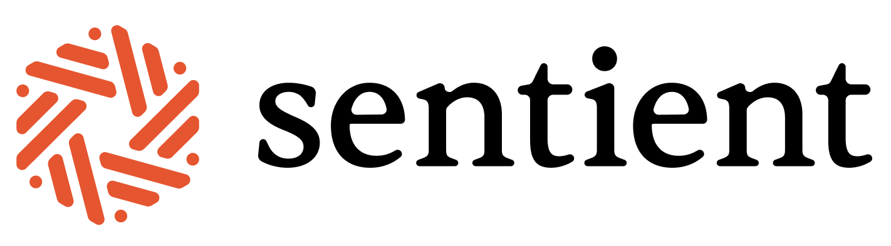
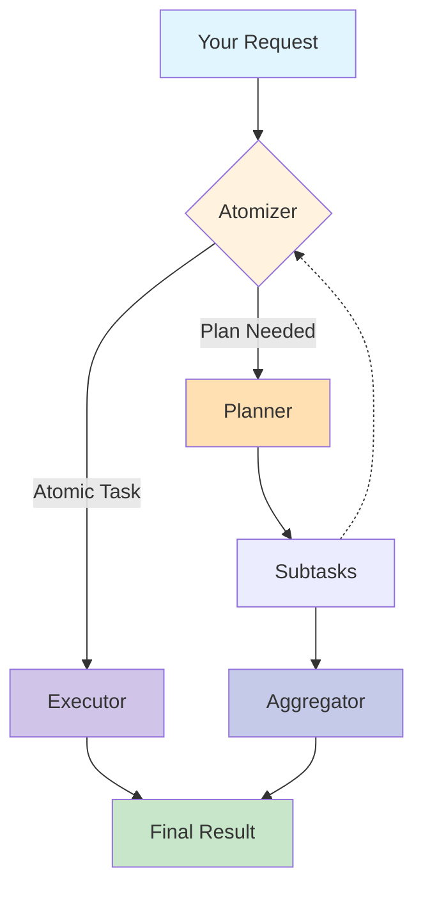

<div align="center">
<div align="center">
    
</div>
<h1>ROMA: Recursive Open Meta-Agents</h1>

<p align="center">
  <strong>Building hierarchical high-performance multi-agent systems made easy! </strong>
</p>


<p align="center">
  <a href="https://github.com/salzubi401/SentientResearchAgent/releases">
    
  </a>
  <a href="https://github.com/salzubi401/SentientResearchAgent/blob/main/LICENSE">
    
  </a>
  <a href="https://www.python.org/downloads/">
    
  </a>
  <a href="https://pdm-project.org">
    
  </a>
  <a href="https://github.com/salzubi401/SentientResearchAgent/stargazers">
    
  </a>
  <a href="https://github.com/salzubi401/SentientResearchAgent/network/members">
    
  </a>
</p>

<p align="center">
  <a href="#-quick-start">Quick Start</a> •
  <a href="#-features">Features</a> •
  <a href="#-examples">Examples</a> •
  <a href="docs/">Documentation</a> •
  <a href="#-community">Community</a> •
  <a href="CONTRIBUTING.md">Contributing</a>
</p>

</div>

---

## 📖 Documentation


### Getting Started
- **[🚀 Introduction](docs/INTRODUCTION.md)** - Understand the vision and architecture behind ROMA

### Core Framework
- **[🧠 Core Concepts](docs/CORE_CONCEPTS.md)** - Master the MECE framework and hierarchical task decomposition
- **[🤖 Agents Guide](docs/AGENTS_GUIDE.md)** - Learn how to create and customize your own agents

- **[⚙️ Configuration](docs/CONFIGURATION.md)** - Detailed configuration options and environment setup

## 🎯 What is ROMA?

**ROMA** is a **meta-agent framework** that uses recursive hierarchical structures to solve complex problems. By breaking down tasks into parallelizable components, ROMA enables agents to tackle sophisticated reasoning challenges while maintaining transparency that makes context-engineering and iteration straightforward. The framework offers **parallel problem solving** where agents work simultaneously on different parts of complex tasks, **transparent development** with a clear structure for easy debugging, and **proven performance** demonstrated through our search agent's strong benchmark results. We've shown the framework's effectiveness, but this is just the beginning. As an **open-source and extensible** platform, ROMA is designed for community-driven development, allowing you to build and customize agents for your specific needs while benefiting from the collective improvements of the community.

## 🏗️ How It Works


**ROMA** framework processes tasks through a recursive **plan–execute loop**:

```python
def solve(task):
    if is_atomic(task):                 # Step 1: Atomizer
        return execute(task)            # Step 2: Executor
    else:
        subtasks = plan(task)           # Step 2: Planner
        results = []
        for subtask in subtasks:
            results.append(solve(subtask))  # Recursive call
        return aggregate(results)       # Step 3: Aggregator

# Entry point:
answer = solve(initial_request)
```
1. **Atomizer** – Decides whether a request is **atomic** (directly executable) or requires **planning**.  
2. **Planner** – If planning is needed, the task is broken into smaller **subtasks**. Each subtask is fed back into the **Atomizer**, making the process recursive.  
3. **Executors** – Handle atomic tasks. Executors can be **LLMs, APIs, or even other agents** — as long as they implement an `agent.execute()` interface.  
4. **Aggregator** – Collects and integrates results from subtasks. Importantly, the Aggregator produces the **answer to the original parent task**, not just raw child outputs.  


#### 📐 Information Flow  
- **Top-down:** Tasks are decomposed into subtasks recursively.  
- **Bottom-up:** Subtask results are aggregated upwards into solutions for parent tasks.  
- **Left-to-right:** If a subtask depends on the output of a previous one, it waits until that subtask completes before execution.  

This structure makes the system flexible, recursive, and dependency-aware — capable of decomposing complex problems into smaller steps while ensuring results are integrated coherently. 

<details>
<summary>Click to view the system flow diagram</summary>



</details><br>

### 🚀 30-Second Quick Start

```bash
# Install
pip install sentientresearchagent  # Coming soon to PyPI

# Or from source
git clone https://github.com/salzubi401/SentientResearchAgent.git
cd SentientResearchAgent
./setup.sh  # Automated setup with Docker or native installation
```

```python
# Your first agent in 3 lines
from sentientresearchagent import SentientAgent

agent = SentientAgent.create()
result = await agent.run("Create a podcast about AI safety")
```

## ✨ Features

<table>
<tr>
<td width="50%">

### 🔄 **Recursive Task Decomposition**
Automatically breaks down complex tasks into manageable subtasks with intelligent dependency management. Runs independent sub-tasks in **parallel**.

</td>
<td width="50%">

### 🤖 **Agent Agnostic**
Works with any provider (OpenAI, Anthropic, Google, local models) through unified interface, as long as it has an `agent.run()` command, then you can use it!

</td>
</tr>
<tr>
<td width="50%">

### 🔍 **Complete Transparency**
Stage tracing shows exactly what happens at each step - debug and optimize with full visibility

</td>
<td width="50%">

### 🔌 Connect Any Tool

Seamlessly integrate external tools and protocols with configurable intervention points. Already includes production-grade connectors such as E2B, file-read-write, and more.

</td>
</tr>
</table>


## 👥 Contributors

Salaheddin Alzu'bi -- Project Lead & Core Contributor

Baran Nama -- Core Contributor

Arda Kaz -- Core Contributor

Sewoong Oh -- Research Oversight


## 🙏 Acknowledgments

This framework would not have been possible if it wasn't for these amazing open-source contributions!
- Inspired by the hierarchical planning approach described in ["Beyond Outlining: Heterogeneous Recursive Planning"](https://arxiv.org/abs/2503.08275) by Xiong et al.
- [Pydantic](https://github.com/pydantic/pydantic) - Data validation using Python type annotations
- [Agno](https://github.com/agno-ai/agno) - Framework for building AI agents
- [E2B](https://github.com/e2b-dev/e2b) - Cloud runtime for AI agents

## 📚 Citation

If you use SentientResearchAgent in your research, please cite:

```bibtex
@software{sentientresearchagent2024,
  title = {SentientResearchAgent: A Hierarchical AI Agent Framework},
  author = {Al-Zubi, Salah},
  year = {2024},
  url = {https://github.com/salzubi401/SentientResearchAgent}
}
```

## 📄 License

This project is licensed under the MIT License - see the [LICENSE](LICENSE) file for details.