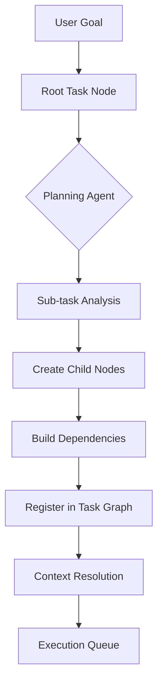
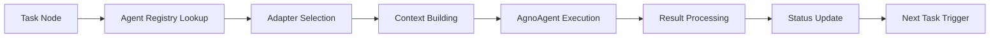

# 🏗️ Architecture Overview

## System Design Philosophy

The Sentient Research Agent framework is built on the principle of **hierarchical task decomposition** with **specialized intelligent agents**. The architecture separates concerns into distinct layers while maintaining sophisticated inter-component communication.

## ��️ Core Architecture 

┌─────────────────────────────────────────────────────────────────┐
│ User Interface Layer │
│ ┌─────────────┐ ┌─────────────┐ ┌─────────────┐ │
│ │ Web UI │ │ Jupyter │ │ Python │ │
│ │ (Frontend) │ │ Notebook │ │ API │ │
│ └─────────────┘ └─────────────┘ └─────────────┘ │
└─────────────────────────────────────────────────────────────────┘
│
┌─────────────────────────────────────────────────────────────────┐
│ High-Level API Layer │
│ ┌─────────────────────────────────────────────────────────┐ │
│ │ SentientAgent (Simplified API) │ │
│ │ • execute(goal) → ExecutionResult │ │
│ │ • stream_execution(goal) → Iterator[Progress] │ │
│ │ • create(config) → SentientAgent │ │
│ └─────────────────────────────────────────────────────────┘ │
└─────────────────────────────────────────────────────────────────┘
│
┌─────────────────────────────────────────────────────────────────┐
│ Framework Orchestration Layer │
│ ┌─────────────┐ ┌─────────────┐ ┌─────────────┐ │
│ │ Execution │ │ State │ │ Node │ │
│ │ Engine │ │ Manager │ │ Processor │ │
│ └─────────────┘ └─────────────┘ └─────────────┘ │
└─────────────────────────────────────────────────────────────────┘
│
┌─────────────────────────────────────────────────────────────────┐
│ Task Graph & Context Layer │
│ ┌─────────────┐ ┌─────────────┐ ┌─────────────┐ │
│ │ Task │ │ Knowledge │ │ Context │ │
│ │ Graph │ │ Store │ │ Builder │ │
│ └─────────────┘ └─────────────┘ └─────────────┘ │
└─────────────────────────────────────────────────────────────────┘
│
┌─────────────────────────────────────────────────────────────────┐
│ Sophisticated Agent System Layer │
│ ┌─────────────┐ ┌─────────────┐ ┌─────────────┐ │
│ │ Agent │ │ Adapter │ │ AgnoAgent │ │
│ │ Registry │ │ System │ │ Framework │ │
│ └─────────────┘ └─────────────┘ └─────────────┘ │
│ │
│ Agent Types: │
│ • PlannerAdapter + PlannerAgnoAgent │
│ • ExecutorAdapter + ExecutorAgnoAgent │
│ • AggregatorAdapter + AggregatorAgnoAgent │
│ • AtomizerAdapter + AtomizerAgnoAgent │
│ • Custom Search Adapters │
│ • Plan Modifier Adapters │
└─────────────────────────────────────────────────────────────────┘
│
┌─────────────────────────────────────────────────────────────────┐
│ External Services Layer │
│ ┌─────────────┐ ┌─────────────┐ ┌─────────────┐ │
│ │ LLM │ │ Search │ │ Storage │ │
│ │ Providers │ │ Services │ │ Systems │ │
│ │ (OpenAI, │ │ (DuckDuckGo,│ │ (File, DB, │ │
│ │ Anthropic, │ │ Custom) │ │ Cache) │ │
│ │ OpenRouter) │ │ │ │ │ │
│ └─────────────┘ └─────────────┘ └─────────────┘ │
└─────────────────────────────────────────────────

## 🔄 Task Execution Flow

### 1. Task Decomposition Process



### 2. Agent Processing Pipeline



## 🤖 Sophisticated Agent System

### Agent Architecture Pattern

Each agent in the system follows a sophisticated two-layer architecture:

┌─────────────────────────────────────────────────────────────┐
│                    Agent Instance                           │
│  ┌─────────────────┐         ┌─────────────────┐          │
│  │     Adapter     │◄──────► │   AgnoAgent     │          │
│  │   (Framework    │         │   (LLM Core)    │          │
│  │   Integration)  │         │                 │          │
│  │                 │         │ • Model Config  │          │
│  │ • Task Routing  │         │ • System Prompt│          │
│  │ • Input/Output  │         │ • Structured    │          │
│  │ • Error Handling│         │   Output        │          │
│  │ • State Mgmt    │         │ • Tool Access   │          │
│  └─────────────────┘         └─────────────────┘          │
└─────────────────────────────────────────────────────────────┘

### Agent Types and Responsibilities

#### 1. **Planning Agents** (PlannerAdapter + AgnoAgent)
- **Purpose**: Decompose complex goals into manageable subtasks
- **Key Features**:
  - Sophisticated goal analysis using structured prompts
  - MECE (Mutually Exclusive, Collectively Exhaustive) decomposition
  - Dependency analysis between subtasks
  - Context-aware planning based on execution history
  - Replanning capabilities when tasks fail

#### 2. **Execution Agents** (ExecutorAdapter + AgnoAgent)
- **Purpose**: Perform specific atomic tasks
- **Specializations**:
  - `SearchExecutor`: Web search and information gathering
  - `SearchSynthesizer`: Search result synthesis and summarization
  - `BasicReportWriter`: Content generation and writing
  - Custom domain-specific executors

#### 3. **Aggregation Agents** (AggregatorAdapter + AgnoAgent)
- **Purpose**: Synthesize results from multiple subtasks
- **Capabilities**:
  - Multi-source information integration
  - Context-aware result combination
  - Final output formatting and quality assurance

#### 4. **Specialized Agents**
- **Atomizer Agents**: Optimize task granularity
- **Plan Modifier Agents**: Handle dynamic plan modifications
- **Custom Search Agents**: Direct integration with search APIs

### Agent Registration System

The framework uses a sophisticated registration system:

```python
# Agent configurations define how agents are registered
AGENT_CONFIGURATIONS = [
    AdapterRegistrationConfig(
        adapter_class=PlannerAdapter,
        agno_agent_instance=core_research_planner_agno_agent,
        adapter_agent_name="CoreResearchPlanner",
        registration_keys=[
            RegistrationKey(action_verb="plan", task_type=TaskType.WRITE),
            RegistrationKey(action_verb="plan", task_type=TaskType.SEARCH),
        ],
        named_registrations=["CoreResearchPlanner", "default_planner"],
    )
]
```

## 📊 Task Graph Management

### Task Node Structure

Each task in the system is represented by a `TaskNode`:

```python
class TaskNode:
    goal: str                    # What to achieve
    task_type: TaskType         # WRITE, THINK, SEARCH, AGGREGATE
    node_type: NodeType         # PLAN or EXECUTE
    status: TaskStatus          # Execution status
    layer: int                  # Hierarchical depth
    parent_node_id: str         # Parent relationship
    planned_sub_task_ids: List[str]  # Child relationships
    # ... rich metadata and context
```

### Status Management

Tasks flow through sophisticated status transitions:

```
PENDING → READY → RUNNING → PLAN_DONE/DONE
                     ↓
              NEEDS_REPLAN ← FAILED
                     ↓
                  READY (retry)
```

## 🧠 Context and Knowledge Management

### Context Building System

The framework maintains sophisticated context across task execution:

- **Global Knowledge Store**: Persistent information across sessions
- **Execution Context**: Task-specific context and dependencies
- **Inter-task Communication**: Structured data passing between agents
- **Historical Context**: Learning from previous executions

### Context Resolution Process

```python
def resolve_context_for_agent(task_node, agent_name, task_type):
    # Gather relevant context from:
    # 1. Parent task outputs
    # 2. Sibling task results  
    # 3. Global knowledge base
    # 4. Execution history
    # 5. User preferences and constraints
    pass
```

## 🔧 Configuration and Extensibility

### Multi-layered Configuration

The system supports configuration at multiple levels:

1. **Framework Configuration**: Core system behavior
2. **Agent Configuration**: Individual agent settings
3. **Execution Configuration**: Runtime parameters
4. **Model Configuration**: LLM provider settings

### Extensibility Points

- **Custom Agents**: Implement new agent types
- **Custom Adapters**: Integrate with external systems
- **Custom Tools**: Add new capabilities to agents
- **Custom Searchers**: Integrate new search providers
- **Plugins**: Extend framework functionality

## 🚀 Performance and Scalability

### Concurrent Execution

- Parallel task processing with dependency management
- Configurable concurrency limits
- Resource management and rate limiting

### Caching and Optimization

- Multi-level caching (memory, file, external)
- Context caching for improved performance
- Result memoization for repeated operations

### Monitoring and Observability

- Detailed execution logging
- Performance metrics collection
- Real-time status monitoring
- Error tracking and analysis

## 🔐 Security and Privacy

### API Key Management

- Environment variable support
- Secure configuration loading
- Provider-specific authentication

### Data Privacy

- Local execution by default
- Configurable external service usage
- Data retention policies

This architecture provides a robust foundation for building sophisticated AI agents while maintaining flexibility and extensibility for diverse use cases.

┌─────────────────────────────────────────────────────────────┐
│ Agent Instance │
│ ┌─────────────────┐ ┌─────────────────┐ │
│ │ Adapter │◄──────► │ AgnoAgent │ │
│ │ (Framework │ │ (LLM Core) │ │
│ │ Integration) │ │ │ │
│ │ │ │ • Model Config │ │
│ │ • Task Routing │ │ • System Prompt│ │
│ │ • Input/Output │ │ • Structured │ │
│ │ • Error Handling│ │ Output │ │
│ │ • State Mgmt │ │ • Tool Access │ │
│ └─────────────────┘ └─────────────────┘ │
└─────────────────────────────────────────────────

### Agent Types and Responsibilities

#### 1. **Planning Agents** (PlannerAdapter + AgnoAgent)
- **Purpose**: Decompose complex goals into manageable subtasks
- **Key Features**:
  - Sophisticated goal analysis using structured prompts
  - MECE (Mutually Exclusive, Collectively Exhaustive) decomposition
  - Dependency analysis between subtasks
  - Context-aware planning based on execution history
  - Replanning capabilities when tasks fail

#### 2. **Execution Agents** (ExecutorAdapter + AgnoAgent)
- **Purpose**: Perform specific atomic tasks
- **Specializations**:
  - `SearchExecutor`: Web search and information gathering
  - `SearchSynthesizer`: Search result synthesis and summarization
  - `BasicReportWriter`: Content generation and writing
  - Custom domain-specific executors

#### 3. **Aggregation Agents** (AggregatorAdapter + AgnoAgent)
- **Purpose**: Synthesize results from multiple subtasks
- **Capabilities**:
  - Multi-source information integration
  - Context-aware result combination
  - Final output formatting and quality assurance

#### 4. **Specialized Agents**
- **Atomizer Agents**: Optimize task granularity
- **Plan Modifier Agents**: Handle dynamic plan modifications
- **Custom Search Agents**: Direct integration with search APIs

### Agent Registration System

The framework uses a sophisticated registration system:

```python
# Agent configurations define how agents are registered
AGENT_CONFIGURATIONS = [
    AdapterRegistrationConfig(
        adapter_class=PlannerAdapter,
        agno_agent_instance=core_research_planner_agno_agent,
        adapter_agent_name="CoreResearchPlanner",
        registration_keys=[
            RegistrationKey(action_verb="plan", task_type=TaskType.WRITE),
            RegistrationKey(action_verb="plan", task_type=TaskType.SEARCH),
        ],
        named_registrations=["CoreResearchPlanner", "default_planner"],
    )
]
```

## 📊 Task Graph Management

### Task Node Structure

Each task in the system is represented by a `TaskNode`:

```python
class TaskNode:
    goal: str                    # What to achieve
    task_type: TaskType         # WRITE, THINK, SEARCH, AGGREGATE
    node_type: NodeType         # PLAN or EXECUTE
    status: TaskStatus          # Execution status
    layer: int                  # Hierarchical depth
    parent_node_id: str         # Parent relationship
    planned_sub_task_ids: List[str]  # Child relationships
    # ... rich metadata and context
```

### Status Management

Tasks flow through sophisticated status transitions:

PENDING → READY → RUNNING → PLAN_DONE/DONE
↓
NEEDS_REPLAN ← FAILED
↓
READY (retry)

## 🧠 Context and Knowledge Management

### Context Building System

The framework maintains sophisticated context across task execution:

- **Global Knowledge Store**: Persistent information across sessions
- **Execution Context**: Task-specific context and dependencies
- **Inter-task Communication**: Structured data passing between agents
- **Historical Context**: Learning from previous executions

### Context Resolution Process

```python
def resolve_context_for_agent(task_node, agent_name, task_type):
    # Gather relevant context from:
    # 1. Parent task outputs
    # 2. Sibling task results  
    # 3. Global knowledge base
    # 4. Execution history
    # 5. User preferences and constraints
    pass
```

## 🔧 Configuration and Extensibility

### Multi-layered Configuration

The system supports configuration at multiple levels:

1. **Framework Configuration**: Core system behavior
2. **Agent Configuration**: Individual agent settings
3. **Execution Configuration**: Runtime parameters
4. **Model Configuration**: LLM provider settings

### Extensibility Points

- **Custom Agents**: Implement new agent types
- **Custom Adapters**: Integrate with external systems
- **Custom Tools**: Add new capabilities to agents
- **Custom Searchers**: Integrate new search providers
- **Plugins**: Extend framework functionality

## 🚀 Performance and Scalability

### Concurrent Execution

- Parallel task processing with dependency management
- Configurable concurrency limits
- Resource management and rate limiting

### Caching and Optimization

- Multi-level caching (memory, file, external)
- Context caching for improved performance
- Result memoization for repeated operations

### Monitoring and Observability

- Detailed execution logging
- Performance metrics collection
- Real-time status monitoring
- Error tracking and analysis

## 🔐 Security and Privacy

### API Key Management

- Environment variable support
- Secure configuration loading
- Provider-specific authentication

### Data Privacy

- Local execution by default
- Configurable external service usage
- Data retention policies

This architecture provides a robust foundation for building sophisticated AI agents while maintaining flexibility and extensibility for diverse use cases.