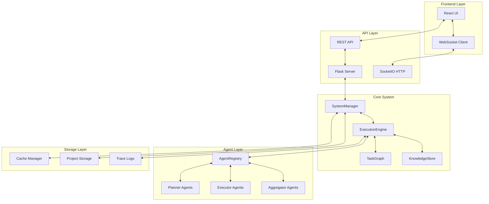
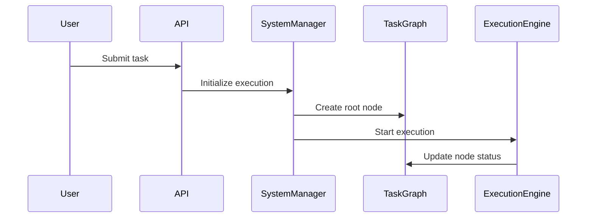
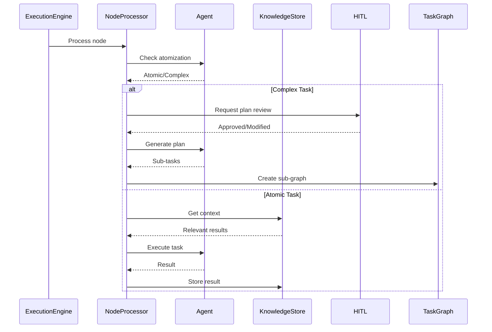
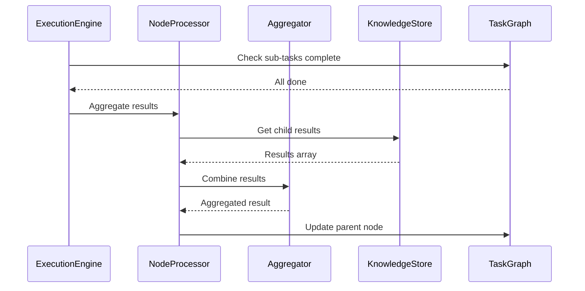

# 🏗️ SentientResearchAgent Architecture

## 📋 Table of Contents

- [System Overview](#-system-overview)
- [Architecture Principles](#-architecture-principles)
- [Core Components](#-core-components)
- [Data Flow](#-data-flow)
- [System Layers](#-system-layers)
- [Component Details](#-component-details)
- [Communication Patterns](#-communication-patterns)
- [Storage & Persistence](#-storage--persistence)
- [Scalability & Performance](#-scalability--performance)
- [Security Considerations](#-security-considerations)

## 🌐 System Overview

SentientResearchAgent is built as a modular, event-driven system with clear separation of concerns:



## 🎯 Architecture Principles

### 1. **Hierarchical Task Decomposition**
- Tasks are recursively broken down into subtasks
- Each level maintains its own context and state
- Bottom-up result aggregation

### 2. **Agent Modularity**
- Agents are pluggable components
- Each agent has a specific role and interface
- Easy to add new agent types

### 3. **Event-Driven Execution**
- State changes trigger events
- Loosely coupled components communicate via events
- Real-time updates through WebSocket

### 4. **Context Preservation**
- Information flows intelligently between tasks
- Results are cached and reused
- No context loss between operations

### 5. **Human-Centric Design**
- HITL (Human-in-the-Loop) at critical decision points
- Real-time visualization of execution
- Intervention and modification capabilities

## 🔧 Core Components

### 1. **SystemManager** (`core/system_manager.py`)

The central orchestrator that initializes and manages all system components:

```python
class SystemManagerV2:
    - config: SentientConfig
    - task_graph: TaskGraph
    - knowledge_store: KnowledgeStore
    - execution_orchestrator: ExecutionOrchestrator
    - agent_registry: AgentRegistry
    - hitl_service: HITLService
```

**Responsibilities:**
- Component lifecycle management
- Configuration propagation
- Profile loading and management
- WebSocket HITL setup

### 2. **TaskGraph** (`graph/task_graph.py`)

Manages the hierarchical structure of tasks:

```python
class TaskGraph:
    - nodes: Dict[str, TaskNode]
    - edges: Set[Tuple[str, str]]
    - sub_graphs: Dict[str, TaskGraph]
```

**Features:**
- Directed acyclic graph (DAG) structure
- Sub-graph support for hierarchical decomposition
- Dependency tracking
- Cycle detection

### 3. **TaskNode** (`node/task_node.py`)

The atomic unit of work:

```python
class TaskNode:
    - task_id: str
    - goal: str
    - task_type: TaskType (SEARCH, WRITE, THINK)
    - node_type: NodeType (PLAN, EXECUTE)
    - status: TaskStatus
    - layer: int
    - result: Any
    - sub_graph_id: Optional[str]
```

**States:**
- `PENDING` → `READY` → `RUNNING` → `DONE`/`FAILED`
- `PLAN_DONE` → `AGGREGATING` → `DONE` (for PLAN nodes)

### 4. **ExecutionEngine** (`graph/execution_engine.py`)

Orchestrates task execution:

```python
class ExecutionEngine:
    - run(): Main execution loop
    - process_ready_nodes(): Process nodes ready for execution
    - update_node_statuses(): State transition management
```

**Execution Strategy:**
- Concurrent execution of independent tasks
- Dependency-aware scheduling
- Deadlock detection and recovery

### 5. **NodeProcessor** (`node/node_processor.py`)

Handles individual node processing:

```python
class NodeProcessor:
    - process_node(): Main processing entry point
    - _process_plan_node(): Handle planning tasks
    - _process_execute_node(): Handle execution tasks
    - _process_aggregation(): Handle result aggregation
```

**Processing Flow:**
1. Atomization check (can task be executed directly?)
2. Context building (gather relevant information)
3. Agent selection and invocation
4. Result storage and propagation

### 6. **AgentRegistry** (`agents/registry.py`)

Manages available agents:

```python
class AgentRegistry:
    - register_agent(): Add new agent
    - get_agent(): Retrieve agent by criteria
    - list_agents(): Get available agents
```

**Agent Types:**
- **Atomizers**: Determine if task needs decomposition
- **Planners**: Break down complex tasks
- **Executors**: Perform actual work
- **Aggregators**: Combine results

### 7. **KnowledgeStore** (`context/knowledge_store.py`)

Manages execution context and results:

```python
class KnowledgeStore:
    - store_result(): Save task results
    - get_relevant_results(): Retrieve context
    - get_lineage_results(): Get parent/sibling results
```

## 🔄 Data Flow

### 1. **Task Initialization**



### 2. **Task Processing**



### 3. **Result Aggregation**



## 🏛️ System Layers

### 1. **Presentation Layer**

**Frontend (React/TypeScript)**
- Real-time task visualization
- HITL interaction interfaces
- WebSocket event handling
- State management (Zustand)

**Key Components:**
- `TaskGraphVisualization`: Visual task tree
- `HITLModal`: Human review interface
- `WebSocketManager`: Real-time communication

### 2. **API Layer**

**Flask Server**
- RESTful endpoints for CRUD operations
- WebSocket support via SocketIO
- Request validation and routing

**Endpoints:**
- `/api/projects/*`: Project management
- `/api/execute`: Task execution
- `/api/websocket`: Real-time events

### 3. **Business Logic Layer**

**Core Services:**
- Task decomposition and planning
- Agent selection and invocation
- Context building and propagation
- State management and transitions

### 4. **Data Access Layer**

**Storage Components:**
- File-based project persistence
- In-memory knowledge store
- Cache management
- Trace logging

## 📡 Communication Patterns

### 1. **WebSocket Events**

```typescript
// Frontend → Backend
interface ExecuteRequest {
  goal: string;
  profile?: string;
  config?: ExecutionConfig;
}

// Backend → Frontend
interface TaskUpdate {
  node: TaskNode;
  graph: TaskGraph;
  timestamp: number;
}
```

### 2. **HITL Communication**

```typescript
interface HITLRequest {
  checkpoint: string;
  node_id: string;
  context: any;
  data_for_review: any;
}

interface HITLResponse {
  action: 'approve' | 'modify' | 'abort';
  modification_instructions?: string;
}
```

### 3. **Agent Communication**

```python
# Agent Input
class AgentTaskInput:
    task: TaskNode
    relevant_context: List[Dict[str, Any]]
    
# Agent Output
class AgentOutput:
    result: Any
    confidence: float
    metadata: Dict[str, Any]
```

## 💾 Storage & Persistence

### 1. **Project Storage**

```
runtime/projects/
├── project_id/
│   ├── metadata.json
│   ├── task_graph.json
│   ├── knowledge_store.json
│   └── traces/
```

### 2. **Cache System**

```
runtime/cache/
├── agent/
│   ├── response_cache.json
│   └── context_cache.json
```

### 3. **Emergency Backups**

```
experiments/emergency_backups/
├── execution_id_timestamp_emergency.json
```

## ⚡ Scalability & Performance

### 1. **Optimization Strategies**

- **Batched Updates**: Reduce WebSocket message frequency
- **Cached Context**: Reuse computed contexts
- **Parallel Execution**: Process independent tasks concurrently
- **Lazy Loading**: Load data only when needed

### 2. **Performance Tuning**

```yaml
execution:
  max_concurrent_nodes: 10
  state_batch_size: 50
  ws_batch_timeout_ms: 100
  enable_immediate_slot_fill: true
```

### 3. **Bottleneck Mitigation**

- **Agent Response Caching**: Reduce LLM API calls
- **Context Compression**: Minimize memory usage
- **Smart Scheduling**: Prioritize critical path tasks

## 🔐 Security Considerations

### 1. **API Security**

- Input validation and sanitization
- Rate limiting per endpoint
- API key management

### 2. **Data Protection**

- Sensitive data exclusion from logs
- Secure storage of API keys
- User data isolation

### 3. **Execution Safety**

- Agent sandboxing
- Resource limits
- Timeout enforcement

## 🎯 Key Design Decisions

### 1. **Why Hierarchical?**
- Natural problem decomposition
- Parallel execution opportunities
- Clear progress tracking
- Human-understandable structure

### 2. **Why Agent-Based?**
- Specialization for different tasks
- Easy extensibility
- Provider independence
- Community contribution

### 3. **Why Event-Driven?**
- Real-time updates
- Loose coupling
- Better testability
- Scalable architecture

### 4. **Why HITL Integration?**
- Quality control
- Continuous improvement
- Trust building
- Training data generation

## 🚀 Future Architecture Enhancements

### Near Term
- Distributed execution support
- Enhanced caching strategies
- Plugin architecture
- Metrics and monitoring

### Long Term
- Multi-agent collaboration protocols
- Self-modifying task graphs
- Cross-system federation
- Blockchain-based agent marketplace

---

## 📚 Related Documentation

- [Core Concepts](CORE_CONCEPTS.md) - Understand the fundamental concepts
- [Execution Flow](EXECUTION_FLOW.md) - Detailed execution walkthrough
- [Agent Guide](AGENTS_GUIDE.md) - Working with the agent system
- [API Reference](API_REFERENCE.md) - Complete API documentation