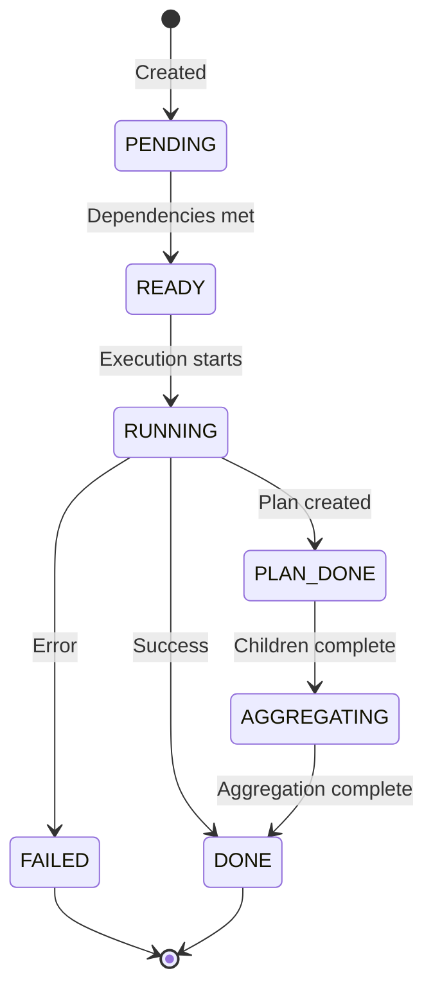

# 🧠 Core Concepts

Understanding these fundamental concepts will help you master SentientResearchAgent and build powerful intelligent systems.

## 📋 Table of Contents

- [Hierarchical Task Decomposition](#-hierarchical-task-decomposition)
- [Task Nodes](#-task-nodes)
- [Node Types](#-node-types)
- [Task Types](#-task-types)
- [Task Status Lifecycle](#-task-status-lifecycle)
- [Agent System](#-agent-system)
- [Context Propagation](#-context-propagation)
- [Knowledge Store](#-knowledge-store)
- [Execution Strategies](#-execution-strategies)
- [Human-in-the-Loop (HITL)](#-human-in-the-loop-hitl)

## 🌳 Hierarchical Task Decomposition

The core principle of SentientResearchAgent is **hierarchical task decomposition** - breaking complex goals into manageable subtasks.

### The Concept

Just like humans solve complex problems, the framework:
1. **Analyzes** the overall goal
2. **Decomposes** it into smaller, focused tasks
3. **Executes** each subtask (potentially decomposing further)
4. **Aggregates** results back up the hierarchy

### Visual Example

```
"Write a research paper on climate change"
├── Research current climate data
│   ├── Search temperature trends
│   ├── Search sea level data
│   └── Search extreme weather patterns
├── Analyze environmental impacts
│   ├── Impact on ecosystems
│   ├── Impact on human societies
│   └── Economic consequences
├── Research mitigation strategies
│   ├── Renewable energy solutions
│   ├── Policy recommendations
│   └── Individual actions
└── Write and format paper
    ├── Create outline
    ├── Write sections
    └── Add citations
```

### Benefits

- **Parallelization**: Independent subtasks run concurrently
- **Specialization**: Different agents handle different task types
- **Clarity**: Complex goals become understandable steps
- **Reusability**: Common subtasks can be cached and reused

## 📦 Task Nodes

A **TaskNode** is the fundamental unit of work in the system.

### Structure

```python
class TaskNode:
    # Identity
    task_id: str              # Unique identifier (e.g., "root.1.2")
    goal: str                 # What this node should accomplish
    
    # Classification
    task_type: TaskType       # SEARCH, WRITE, or THINK
    node_type: NodeType       # PLAN or EXECUTE
    
    # Hierarchy
    layer: int                # Depth in the task tree (0 = root)
    parent_node_id: str       # Parent task reference
    sub_graph_id: str         # Reference to subtask graph (PLAN nodes)
    
    # State
    status: TaskStatus        # Current execution state
    result: Any               # Task output
    error: str                # Error message if failed
    
    # Metadata
    timestamp_created: datetime
    timestamp_completed: datetime
    agent_name: str           # Which agent processed this
```

### Example TaskNode

```json
{
  "task_id": "root.1",
  "goal": "Research renewable energy trends in 2024",
  "task_type": "SEARCH",
  "node_type": "EXECUTE",
  "layer": 1,
  "parent_node_id": "root",
  "status": "DONE",
  "result": {
    "content": "Solar capacity increased by 73%...",
    "sources": ["IEA Report 2024", "Bloomberg NEF"],
    "confidence": 0.92
  }
}
```

## 🎭 Node Types

### PLAN Nodes

**Purpose**: Decompose complex tasks into subtasks

```python
# PLAN node example
{
  "node_type": "PLAN",
  "goal": "Analyze market trends",
  "sub_graph_id": "subgraph_123",  # Points to child tasks
  "planned_sub_task_ids": ["root.1", "root.2", "root.3"]
}
```

**Characteristics**:
- Never execute work directly
- Create and manage subtasks
- Aggregate results from children
- Can be nested (plans within plans)

### EXECUTE Nodes

**Purpose**: Perform actual work

```python
# EXECUTE node example
{
  "node_type": "EXECUTE",
  "goal": "Search for latest AI breakthroughs",
  "agent_name": "SearchAgent",
  "result": "Found 15 relevant papers..."
}
```

**Characteristics**:
- Leaf nodes in the task tree
- Use specialized agents
- Produce concrete results
- Cannot have subtasks

## 🏷️ Task Types

Task types determine which agents handle the work:

### 1. SEARCH Tasks 🔍

**Purpose**: Information retrieval and research

```python
TaskType.SEARCH
```

**Examples**:
- Web searches
- Database queries
- Literature reviews
- Fact checking

**Typical Agents**: Web searchers, database connectors, research specialists

### 2. WRITE Tasks ✍️

**Purpose**: Content generation and synthesis

```python
TaskType.WRITE
```

**Examples**:
- Report writing
- Code generation
- Documentation
- Creative writing

**Typical Agents**: Writers, coders, formatters, editors

### 3. THINK Tasks 🤔

**Purpose**: Analysis, reasoning, and decision-making

```python
TaskType.THINK
```

**Examples**:
- Data analysis
- Strategy planning
- Problem solving
- Evaluation

**Typical Agents**: Analyzers, planners, evaluators, reasoners

## 🔄 Task Status Lifecycle

Tasks progress through specific states:



### Status Definitions

- **PENDING**: Created but waiting for dependencies
- **READY**: All dependencies met, ready to execute
- **RUNNING**: Currently being processed
- **PLAN_DONE**: Planning complete, waiting for subtasks
- **AGGREGATING**: Combining results from subtasks
- **DONE**: Successfully completed
- **FAILED**: Encountered an error
- **CANCELLED**: Aborted by user

## 🤖 Agent System

Agents are the workers that process tasks. Each agent specializes in specific operations.

### Agent Roles

#### 1. Atomizer Agents

**Purpose**: Determine if a task needs decomposition

```python
Input: "Write a blog post about AI"
Output: {
  "is_atomic": False,  # Too complex, needs planning
  "refined_goal": "Write comprehensive blog post about AI developments"
}
```

#### 2. Planner Agents

**Purpose**: Decompose complex tasks

```python
Input: "Research and compare cloud providers"
Output: {
  "subtasks": [
    {"goal": "Research AWS features and pricing", "type": "SEARCH"},
    {"goal": "Research Azure features and pricing", "type": "SEARCH"},
    {"goal": "Research GCP features and pricing", "type": "SEARCH"},
    {"goal": "Create comparison matrix", "type": "THINK"},
    {"goal": "Write recommendation report", "type": "WRITE"}
  ]
}
```

#### 3. Executor Agents

**Purpose**: Perform actual work

```python
Input: "Search for quantum computing applications"
Output: {
  "result": "Found 5 key applications: cryptography, drug discovery...",
  "sources": ["Nature 2024", "MIT Research"],
  "confidence": 0.88
}
```

#### 4. Aggregator Agents

**Purpose**: Combine results from subtasks

```python
Input: [result1, result2, result3]
Output: {
  "summary": "Comprehensive analysis shows...",
  "key_findings": ["Finding 1", "Finding 2"],
  "conclusion": "Based on all research..."
}
```

## 🔗 Context Propagation

Context ensures information flows intelligently between tasks.

### Context Types

#### 1. Lineage Context
Information from parent and ancestor tasks:
```python
{
  "overall_objective": "Write investment report",
  "parent_goal": "Analyze tech stocks",
  "constraints": ["Focus on 2024 data", "Include ESG factors"]
}
```

#### 2. Sibling Context
Results from completed sibling tasks:
```python
{
  "sibling_results": [
    {"task": "Research Company A", "result": "..."},
    {"task": "Research Company B", "result": "..."}
  ]
}
```

#### 3. Global Context
System-wide information:
```python
{
  "execution_id": "abc123",
  "timestamp": "2024-01-15",
  "user_preferences": {"style": "formal", "length": "detailed"}
}
```

### Context Flow Example

```
Root Task (context: user request)
    ↓ (passes objective)
Plan Node (context: objective + constraints)
    ↓ (passes plan context)
Execute Node 1 (context: plan + objective)
    → (shares results)
Execute Node 2 (context: plan + objective + Node1 results)
    ↑ (aggregates all)
Aggregator (context: all child results + original objective)
```

## 💾 Knowledge Store

The Knowledge Store maintains execution state and enables context sharing.

### Key Functions

#### 1. Result Storage
```python
knowledge_store.store_node_result(
    node_id="root.1",
    result={"content": "Analysis complete...", "score": 0.95}
)
```

#### 2. Context Retrieval
```python
# Get results from same level
sibling_results = knowledge_store.get_sibling_results("root.2")

# Get parent context
parent_context = knowledge_store.get_parent_context("root.2.1")

# Get all relevant context
context = knowledge_store.get_relevant_results_for_node(node)
```

#### 3. Lineage Tracking
```python
# Get complete execution path
lineage = knowledge_store.get_node_lineage("root.1.2.3")
# Returns: ["root", "root.1", "root.1.2", "root.1.2.3"]
```

### Storage Optimization

- **In-memory caching** for fast access
- **Selective persistence** for important results
- **Context summarization** to manage size
- **TTL-based cleanup** for old data

## ⚡ Execution Strategies

### 1. Parallel Execution

Independent tasks run simultaneously:

```
        [Task A] ──┐
Root ──→ [Task B] ──┼──→ Aggregator
        [Task C] ──┘
```

**Configuration**:
```yaml
execution:
  max_concurrent_nodes: 10
  enable_immediate_slot_fill: true
```

### 2. Sequential Execution

Tasks with dependencies run in order:

```
Root ──→ [Task A] ──→ [Task B] ──→ [Task C] ──→ Result
```

**Use Case**: When each task depends on the previous one

### 3. Mixed Strategy

Combination of parallel and sequential:

```
        ┌─→ [Research A] ─┐
Root ──→│                 ├──→ [Analysis] ──→ [Report]
        └─→ [Research B] ─┘
```

### 4. Depth-First vs Breadth-First

**Depth-First**: Complete one branch before starting another
- Lower memory usage
- Better for deep hierarchies

**Breadth-First**: Process all nodes at same level first
- Better parallelization
- Good for wide, shallow trees

## 🎮 Human-in-the-Loop (HITL)

HITL enables human oversight and intervention at critical points.

### Intervention Points

#### 1. Plan Review
Before executing a generated plan:
```python
{
  "checkpoint": "plan_generation",
  "node_id": "root",
  "plan": {
    "subtasks": [...],
    "strategy": "parallel_research_then_synthesis"
  }
}
```

#### 2. Atomization Review
When deciding task complexity:
```python
{
  "checkpoint": "atomization",
  "node_id": "root.1",
  "decision": "too_complex_needs_planning",
  "reasoning": "Task requires multiple research steps"
}
```

#### 3. Pre-Execution Review
Before executing atomic tasks:
```python
{
  "checkpoint": "pre_execution",
  "node_id": "root.2.1",
  "agent": "WebSearcher",
  "action": "search_academic_papers"
}
```

### HITL Configuration

```yaml
execution:
  enable_hitl: true
  hitl_root_plan_only: true  # Only review top-level plans
  hitl_timeout_seconds: 300  # 5-minute timeout
```

### HITL Benefits

- **Quality Control**: Catch issues before execution
- **Learning**: System improves from corrections
- **Trust**: Users maintain control
- **Flexibility**: Adapt to changing requirements

## 🎯 Putting It All Together

Here's how these concepts work in practice:

1. **User submits goal** → Creates root TaskNode
2. **Atomizer checks complexity** → Determines PLAN vs EXECUTE
3. **Planner decomposes** → Creates subtask graph
4. **Scheduler activates tasks** → Based on dependencies
5. **Executors process** → Using specialized agents
6. **Context flows** → Between related tasks
7. **Results aggregate** → Bottom-up synthesis
8. **HITL intervenes** → At configured checkpoints
9. **Final result emerges** → From hierarchical processing

## 💡 Best Practices

### 1. Task Granularity
- Not too broad: "Solve world hunger" ❌
- Not too narrow: "Type the letter A" ❌
- Just right: "Research food security initiatives in Africa" ✅

### 2. Agent Selection
- Match agents to task types
- Use specialized agents for better results
- Create custom agents for domain-specific needs

### 3. Context Management
- Keep context focused and relevant
- Summarize when passing between layers
- Preserve critical information

### 4. Error Handling
- Plan for failure at each level
- Implement retry strategies
- Provide meaningful error messages

---

## 📚 Next Steps

Now that you understand the core concepts:

- [Agents Guide](AGENTS_GUIDE.md) - Deep dive into the agent system
- [Execution Flow](EXECUTION_FLOW.md) - Step-by-step execution walkthrough
- [Examples](examples/) - See these concepts in action

Remember: The power of SentientResearchAgent comes from combining these simple concepts into sophisticated systems. Start simple, experiment, and build your way up to complex workflows! 🚀