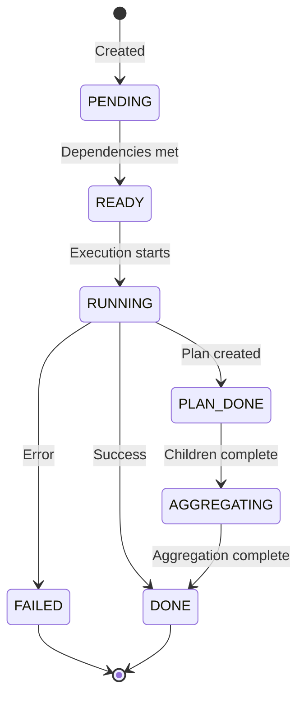

# 🧠 Core Concepts

Understanding these fundamental concepts will help you master SentientResearchAgent and build powerful intelligent systems.

## 📋 Table of Contents

- [The MECE Framework](#-the-mece-framework)
- [Hierarchical Task Decomposition](#-hierarchical-task-decomposition)
- [Execution Flow Architecture](#-execution-flow-architecture)
- [Recursive Depth Control](#-recursive-depth-control)
- [Stage Tracing & Transparency](#-stage-tracing--transparency)
- [Task Nodes](#-task-nodes)
- [Node Types](#-node-types)
- [Task Types](#-task-types)
- [Task Status Lifecycle](#-task-status-lifecycle)
- [Agent System](#-agent-system)
- [Context Propagation](#-context-propagation)
- [Knowledge Store](#-knowledge-store)
- [Execution Strategies](#-execution-strategies)
- [Human-in-the-Loop (HITL)](#-human-in-the-loop-hitl)

## 🎯 The MECE Framework

At the heart of SentientResearchAgent lies the **MECE principle** (Mutually Exclusive, Collectively Exhaustive), which provides a universal framework for decomposing ANY task into three fundamental operations.

### What is MECE?

MECE is a problem-solving principle that ensures complete coverage without overlap:
- **Mutually Exclusive**: Each operation type is distinct—there's no ambiguity about whether something is a THINK, WRITE, or SEARCH operation
- **Collectively Exhaustive**: These three operations cover ALL possible tasks—there's nothing you need to do that doesn't fit into one of these categories

### The Three Universal Operations

#### 🤔 THINK - Reasoning & Analysis
Any cognitive operation that processes information without creating new content or retrieving external data:
- **Data Analysis**: Finding patterns, trends, insights
- **Decision Making**: Choosing between options, evaluating trade-offs
- **Planning**: Breaking down problems, creating strategies
- **Evaluation**: Assessing quality, checking correctness
- **Problem Solving**: Finding solutions, debugging issues

#### ✍️ WRITE - Content Generation & Synthesis
Any operation that creates new content or synthesizes existing information:
- **Document Creation**: Reports, articles, documentation
- **Code Generation**: Writing programs, scripts, configurations
- **Creative Content**: Stories, scripts, marketing copy
- **Synthesis**: Combining multiple sources into cohesive output
- **Formatting**: Structuring and presenting information

#### 🔍 SEARCH - Information Retrieval
Any operation that gathers information from external sources:
- **Web Research**: Finding online information
- **Database Queries**: Retrieving structured data
- **API Calls**: Fetching from external services
- **Literature Review**: Academic or technical research
- **Data Collection**: Gathering raw information

### Why MECE Matters

1. **Universal Applicability**: ANY task can be broken down into these three operations
2. **Clear Boundaries**: No confusion about which operation to use
3. **Complete Coverage**: Nothing falls through the cracks
4. **Scalable Complexity**: Simple tasks use few operations, complex tasks use many

### MECE in Action

Consider building a market analysis report:

```
Goal: "Create a comprehensive market analysis for electric vehicles"

Decomposition:
1. SEARCH: Gather market data and statistics
2. SEARCH: Find competitor information
3. SEARCH: Collect regulatory information
4. THINK: Analyze market trends
5. THINK: Identify opportunities and threats
6. WRITE: Create executive summary
7. WRITE: Detailed analysis sections
8. THINK: Review and ensure coherence
9. WRITE: Final report with recommendations
```

Each operation is clearly one type, and together they completely achieve the goal.

## 🔄 Execution Flow Architecture

SentientResearchAgent uses a sophisticated three-directional execution flow that mirrors natural problem-solving:

### 1. **Top-Down Decomposition** ⬇️
Tasks flow from general to specific:
```
"Build a mobile app" (General)
    ↓
"Design UI" + "Build Backend" + "Write Tests" (Specific)
    ↓
"Create login screen" + "Design dashboard" + ... (More Specific)
```

### 2. **Bottom-Up Aggregation** ⬆️
Results flow from specific to general:
```
Individual UI screens (Specific)
    ↑
Complete UI design (Less Specific)
    ↑
Fully functional app (General)
```

### 3. **Left-to-Right Dependencies** ➡️
Tasks can depend on siblings for context:
```
"Research users" → "Design features" → "Build MVP"
     (First)           (Uses research)    (Uses both)
```

### Execution Flow Visualization

```
     ┌─────────────────┐
     │   Root Goal     │ 
     └────────┬────────┘
              │
     ┌────────▼────────┐
     │    ATOMIZER     │ ← Decides: PLAN or EXECUTE?
     └────────┬────────┘
              │ If PLAN
     ┌────────▼────────┐
     │   PLAN NODE     │ ← Decomposes into subtasks
     └────────┬────────┘
              │ Showcasing all three building blocks:
     ┌────────┴────────┬──────────────┐
     ▼                 ▼              ▼
┌─────────┐      ┌─────────┐    ┌─────────┐
│ SEARCH  │      │ THINK   │───▶│ WRITE   │ Left-Right
│Gather   │      │Analyze  │    │Create   │ Dependency
│Data     │      │Results  │    │Report   │ (optional)
└────┬────┘      └────┬────┘    └────┬────┘
     │                 │              │
     ▼                 ▼              ▼
[ATOMIZER]        [ATOMIZER]     [ATOMIZER] ← 🔄 RECURSIVE
     │                 │              │        Each subtask
     ▼                 ▼              ▼        repeats process
[EXECUTE or       [EXECUTE or     [EXECUTE or
 PLAN again]       PLAN again]     PLAN again]
     │                 │              │
     └─────────────────┴──────────────┘
                       │
              ┌────────▼────────┐
              │   AGGREGATOR    │ ← Combines all results
              └────────┬────────┘
                       │ Returns to parent
              ┌────────▼────────┐
              │  Final Result   │
              └─────────────────┘

📌 Key Points:
- ➡️ Horizontal arrows show dependencies (task waits for predecessor)
- 🔄 RECURSIVE: Each node can spawn its own subtree
- Tasks without dependencies execute in parallel
```

### The Recursive Process

1. **Every task starts at an ATOMIZER**
   - Evaluates task complexity
   - Decides: Can this be executed directly (EXECUTE) or needs planning (PLAN)?

2. **If EXECUTE node**:
   - Task is atomic (can't be broken down further)
   - Appropriate executor agent is called
   - Result is returned

3. **If PLAN node**:
   - Task is complex and needs decomposition
   - Planner agent breaks it into subtasks (THINK, WRITE, or SEARCH)
   - Each subtask goes through its own atomizer
   - Process repeats recursively to any depth

4. **Horizontal Dependencies** (Optional):
   - Tasks can depend on siblings at the same level
   - Dependent tasks wait for predecessors to complete
   - Results flow left-to-right when dependencies exist
   - Independent tasks execute in parallel

5. **AGGREGATOR collects results**:
   - Once all subtasks complete
   - Combines results intelligently based on context
   - Returns synthesized result to parent
   - Parent may itself be a subtask in a larger tree

## 🎚️ Recursive Depth Control

One of SentientResearchAgent's most powerful features is **customizable recursion depth**, allowing you to control the granularity of task decomposition.

### Depth Levels Explained

#### **Depth 1 - Direct Execution**
```
Goal: "Summarize this article"
→ WRITE: Create summary (Done)
```
- Single operation
- No decomposition
- Fastest execution

#### **Depth 2 - Basic Decomposition**
```
Goal: "Research and summarize quantum computing"
├── SEARCH: Find quantum computing information
└── WRITE: Create summary
```
- Simple two-step process
- Minimal overhead
- Good for straightforward tasks

#### **Depth 3-4 - Balanced Approach**
```
Goal: "Create a blog post about AI ethics"
├── SEARCH: Research AI ethics topics
├── THINK: Identify key themes
├── WRITE: Create outline
├── WRITE: Develop each section
└── THINK: Review and refine
```
- Thorough but efficient
- Good balance of depth and speed
- Suitable for most use cases

#### **Depth 5+ - Comprehensive Analysis**
```
Goal: "Develop a business strategy for entering Asian markets"
├── SEARCH: Market research for each country
│   ├── SEARCH: Japan market data
│   ├── SEARCH: China market data
│   └── SEARCH: Southeast Asia data
├── THINK: Analyze market opportunities
│   ├── THINK: Evaluate market sizes
│   ├── THINK: Assess competition
│   └── THINK: Identify barriers
├── WRITE: Country-specific strategies
│   ├── WRITE: Japan entry plan
│   ├── WRITE: China entry plan
│   └── WRITE: SEA entry plan
└── WRITE: Comprehensive strategy document
```
- Maximum thoroughness
- Complex multi-level analysis
- For critical, high-stakes tasks

### Controlling Depth

```python
# Shallow depth for quick tasks
agent = SentientAgent.create(max_depth=2)
quick_result = await agent.run("Summarize this article")

# Deep depth for comprehensive analysis
agent = SentientAgent.create(max_depth=5)
detailed_result = await agent.run("Create a complete business plan")

# Automatic depth (recommended)
agent = SentientAgent.create()  # System determines optimal depth
result = await agent.run("Your task here")
```

### Depth Guidelines

| Task Complexity | Recommended Depth | Use Cases |
|----------------|-------------------|-----------|
| Simple | 1-2 | Summaries, quick searches, basic writing |
| Moderate | 3-4 | Blog posts, reports, standard analysis |
| Complex | 5-6 | Research papers, business strategies |
| Very Complex | 7+ | Multi-domain projects, comprehensive systems |

## 🔍 Stage Tracing & Transparency

**Stage Tracing** is what sets SentientResearchAgent apart—complete visibility into every step of the execution process.

### What is Stage Tracing?

Stage Tracing provides a detailed log of:
- **Inputs**: Exactly what each agent receives
- **Processing**: How the agent interprets and processes the input
- **Outputs**: What the agent produces
- **Context**: The surrounding information used
- **Decisions**: Why certain choices were made

### Benefits of Stage Tracing

1. **Debugging Made Easy**
   - See exactly where issues occur
   - Understand why certain outputs were produced
   - Identify bottlenecks or inefficiencies

2. **Optimization Opportunities**
   - Find redundant operations
   - Identify slow stages
   - Optimize prompts and workflows

3. **Trust Through Transparency**
   - No "black box" mystery
   - Understand the reasoning process
   - Verify correctness at each step

4. **Rapid Iteration**
   - See immediate effects of changes
   - Test different approaches quickly
   - Build confidence in your agents

### Stage Tracing Example

```json
{
  "stage": "task_planning",
  "node_id": "root.1",
  "timestamp": "2024-01-15T10:30:00Z",
  "input": {
    "goal": "Create a podcast about renewable energy",
    "context": {
      "user_preferences": "engaging, 10 minutes, general audience"
    }
  },
  "agent": "PodcastPlanner",
  "processing": {
    "identified_subtasks": [
      "Research trending renewable energy topics",
      "Select most engaging angle",
      "Create episode structure",
      "Write script with timestamps"
    ],
    "reasoning": "Podcast creation requires research, planning, and writing phases"
  },
  "output": {
    "plan": {
      "tasks": [
        {"id": "1", "type": "SEARCH", "goal": "Research trending renewable energy topics"},
        {"id": "2", "type": "THINK", "goal": "Select most engaging angle for general audience"},
        {"id": "3", "type": "WRITE", "goal": "Create episode structure with segments"},
        {"id": "4", "type": "WRITE", "goal": "Write full script with timestamps"}
      ]
    }
  },
  "metrics": {
    "processing_time": 1.2,
    "tokens_used": 450
  }
}
```

### Accessing Stage Traces

```python
# Enable detailed tracing
agent = SentientAgent.create(enable_tracing=True)
result = await agent.run("Your task")

# Access the trace
trace = result.execution_trace
for stage in trace.stages:
    print(f"Stage: {stage.name}")
    print(f"Input: {stage.input}")
    print(f"Output: {stage.output}")
    print(f"Duration: {stage.duration}s")
```

### Using Traces for Improvement

1. **Identify Slow Stages**
   ```python
   slow_stages = [s for s in trace.stages if s.duration > 5.0]
   ```

2. **Find Failed Operations**
   ```python
   failures = [s for s in trace.stages if s.status == "failed"]
   ```

3. **Analyze Token Usage**
   ```python
   total_tokens = sum(s.tokens_used for s in trace.stages)
   ```

4. **Export for Analysis**
   ```python
   trace.export_to_json("execution_trace.json")
   trace.export_to_csv("execution_metrics.csv")
   ```

## 🌳 Hierarchical Task Decomposition

The core principle of SentientResearchAgent is **hierarchical task decomposition** through a recursive atomizer-planner-executor architecture.

### The Concept

The framework mirrors human problem-solving through a recursive process:
1. **Atomizer evaluates** - Is this task atomic or does it need planning?
2. **If atomic** - Execute directly with appropriate agent
3. **If complex** - Plan and decompose into subtasks (THINK, WRITE, SEARCH)
4. **Recursively process** - Each subtask goes through the same evaluation
5. **Aggregate results** - Combine outputs bottom-up through aggregators

### Visual Example with Atomizer Flow

```
"Write a research paper on climate change" 
            │
            ▼ [ATOMIZER: Too complex → PLAN]
├── Research current climate data
│   │
│   ▼ [ATOMIZER: Too complex → PLAN]
│   ├── Search temperature trends
│   │   ▼ [ATOMIZER: Atomic → EXECUTE]
│   ├── Search sea level data
│   │   ▼ [ATOMIZER: Atomic → EXECUTE]
│   └── Search extreme weather patterns
│       ▼ [ATOMIZER: Atomic → EXECUTE]
│   ▲ [AGGREGATOR: Combine search results]
│
├── Analyze environmental impacts
│   │
│   ▼ [ATOMIZER: Too complex → PLAN]
│   ├── Impact on ecosystems
│   │   ▼ [ATOMIZER: Atomic → EXECUTE]
│   ├── Impact on human societies
│   │   ▼ [ATOMIZER: Atomic → EXECUTE]
│   └── Economic consequences
│       ▼ [ATOMIZER: Atomic → EXECUTE]
│   ▲ [AGGREGATOR: Synthesize analysis]
│
└── Write and format paper
    │
    ▼ [ATOMIZER: Too complex → PLAN]
    ├── Create outline
    │   ▼ [ATOMIZER: Atomic → EXECUTE]
    ├── Write sections
    │   ▼ [ATOMIZER: Atomic → EXECUTE]
    └── Add citations
        ▼ [ATOMIZER: Atomic → EXECUTE]
    ▲ [AGGREGATOR: Compile final paper]
```

### Key Components in Action

1. **ATOMIZER** - The gatekeeper that decides task handling:
   - Evaluates complexity
   - Routes to PLAN or EXECUTE
   - Ensures appropriate decomposition depth

2. **PLAN NODE** - The decomposer:
   - Breaks complex tasks into MECE subtasks
   - Assigns task types (THINK, WRITE, SEARCH)
   - Defines dependencies

3. **EXECUTE NODE** - The worker:
   - Handles atomic tasks
   - Uses specialized agents
   - Returns concrete results

4. **AGGREGATOR** - The synthesizer:
   - Collects all subtask results
   - Combines intelligently based on context
   - Returns unified output to parent

### Benefits

- **Intelligent Decomposition**: Atomizer ensures optimal task breakdown
- **Parallelization**: Independent subtasks run concurrently
- **Specialization**: Right agent for each task type
- **Clarity**: Complex goals become traceable execution paths
- **Flexibility**: Recursive depth adapts to task complexity

## 📦 Task Nodes

A **TaskNode** is the fundamental unit of work in the system.

### Structure

```python
class TaskNode:
    # Identity
    task_id: str              # Unique identifier (e.g., "root.1.2")
    goal: str                 # What this node should accomplish
    
    # Classification
    task_type: TaskType       # SEARCH, WRITE, or THINK
    node_type: NodeType       # PLAN or EXECUTE
    
    # Hierarchy
    layer: int                # Depth in the task tree (0 = root)
    parent_node_id: str       # Parent task reference
    sub_graph_id: str         # Reference to subtask graph (PLAN nodes)
    
    # State
    status: TaskStatus        # Current execution state
    result: Any               # Task output
    error: str                # Error message if failed
    
    # Metadata
    timestamp_created: datetime
    timestamp_completed: datetime
    agent_name: str           # Which agent processed this
```

### Example TaskNode

```json
{
  "task_id": "root.1",
  "goal": "Research renewable energy trends in 2024",
  "task_type": "SEARCH",
  "node_type": "EXECUTE",
  "layer": 1,
  "parent_node_id": "root",
  "status": "DONE",
  "result": {
    "content": "Solar capacity increased by 73%...",
    "sources": ["IEA Report 2024", "Bloomberg NEF"],
    "confidence": 0.92
  }
}
```

## 🎭 Node Types

### PLAN Nodes

**Purpose**: Decompose complex tasks into subtasks

```python
# PLAN node example
{
  "node_type": "PLAN",
  "goal": "Analyze market trends",
  "sub_graph_id": "subgraph_123",  # Points to child tasks
  "planned_sub_task_ids": ["root.1", "root.2", "root.3"]
}
```

**Characteristics**:
- Never execute work directly
- Create and manage subtasks
- Aggregate results from children
- Can be nested (plans within plans)

### EXECUTE Nodes

**Purpose**: Perform actual work

```python
# EXECUTE node example
{
  "node_type": "EXECUTE",
  "goal": "Search for latest AI breakthroughs",
  "agent_name": "SearchAgent",
  "result": "Found 15 relevant papers..."
}
```

**Characteristics**:
- Leaf nodes in the task tree
- Use specialized agents
- Produce concrete results
- Cannot have subtasks

## 🏷️ Task Types

Task types in SentientResearchAgent directly map to the MECE framework operations:

### 1. SEARCH Tasks 🔍

**Purpose**: Information retrieval - gathering data from external sources

```python
TaskType.SEARCH
```

**Key Characteristics**:
- Always retrieves information from outside the current context
- Does not create new content
- Does not analyze or make decisions
- Pure information gathering

**Examples**:
- Web searches for current information
- Database queries for specific data
- API calls to external services
- Literature reviews and research
- Fact checking and verification

**Typical Agents**: Web searchers, database connectors, API integrators, research specialists

### 2. WRITE Tasks ✍️

**Purpose**: Content generation - creating new information or synthesizing existing

```python
TaskType.WRITE
```

**Key Characteristics**:
- Creates new content that didn't exist before
- Synthesizes information into new forms
- Produces tangible outputs
- Does not retrieve external information
- Does not make analytical decisions

**Examples**:
- Report writing and documentation
- Code generation and implementation
- Creative content (stories, scripts)
- Summary and synthesis creation
- Formatting and presentation

**Typical Agents**: Writers, coders, synthesizers, formatters, content creators

### 3. THINK Tasks 🤔

**Purpose**: Analysis and reasoning - processing information to make decisions

```python
TaskType.THINK
```

**Key Characteristics**:
- Analyzes existing information
- Makes decisions and evaluations
- Plans and strategizes
- Does not create new content
- Does not retrieve external data

**Examples**:
- Data analysis and pattern recognition
- Strategic planning and decision making
- Problem solving and debugging
- Quality evaluation and review
- Task decomposition and planning

**Typical Agents**: Analyzers, planners, evaluators, strategists, decision makers

### The MECE Guarantee

These three task types are:
- **Mutually Exclusive**: A task is always exactly one type
- **Collectively Exhaustive**: Every possible task fits into one category

This clean separation enables:
- Clear agent specialization
- Predictable execution patterns
- Easy debugging and optimization
- Universal applicability

## 🔄 Task Status Lifecycle

Tasks progress through specific states:



### Status Definitions

- **PENDING**: Created but waiting for dependencies
- **READY**: All dependencies met, ready to execute
- **RUNNING**: Currently being processed
- **PLAN_DONE**: Planning complete, waiting for subtasks
- **AGGREGATING**: Combining results from subtasks
- **DONE**: Successfully completed
- **FAILED**: Encountered an error
- **CANCELLED**: Aborted by user

## 🤖 Agent System

Agents are the workers that process tasks. Each agent specializes in specific operations.

### Agent Roles

#### 1. Atomizer Agents

**Purpose**: Determine if a task needs decomposition

```python
Input: "Write a blog post about AI"
Output: {
  "is_atomic": False,  # Too complex, needs planning
  "refined_goal": "Write comprehensive blog post about AI developments"
}
```

#### 2. Planner Agents

**Purpose**: Decompose complex tasks

```python
Input: "Research and compare cloud providers"
Output: {
  "subtasks": [
    {"goal": "Research AWS features and pricing", "type": "SEARCH"},
    {"goal": "Research Azure features and pricing", "type": "SEARCH"},
    {"goal": "Research GCP features and pricing", "type": "SEARCH"},
    {"goal": "Create comparison matrix", "type": "THINK"},
    {"goal": "Write recommendation report", "type": "WRITE"}
  ]
}
```

#### 3. Executor Agents

**Purpose**: Perform actual work

```python
Input: "Search for quantum computing applications"
Output: {
  "result": "Found 5 key applications: cryptography, drug discovery...",
  "sources": ["Nature 2024", "MIT Research"],
  "confidence": 0.88
}
```

#### 4. Aggregator Agents

**Purpose**: Combine results from subtasks

```python
Input: [result1, result2, result3]
Output: {
  "summary": "Comprehensive analysis shows...",
  "key_findings": ["Finding 1", "Finding 2"],
  "conclusion": "Based on all research..."
}
```

## 🔗 Context Propagation

Context ensures information flows intelligently between tasks.

### Context Types

#### 1. Lineage Context
Information from parent and ancestor tasks:
```python
{
  "overall_objective": "Write investment report",
  "parent_goal": "Analyze tech stocks",
  "constraints": ["Focus on 2024 data", "Include ESG factors"]
}
```

#### 2. Sibling Context
Results from completed sibling tasks:
```python
{
  "sibling_results": [
    {"task": "Research Company A", "result": "..."},
    {"task": "Research Company B", "result": "..."}
  ]
}
```

#### 3. Global Context
System-wide information:
```python
{
  "execution_id": "abc123",
  "timestamp": "2024-01-15",
  "user_preferences": {"style": "formal", "length": "detailed"}
}
```

### Context Flow Example

```
Root Task (context: user request)
    ↓ (passes objective)
Plan Node (context: objective + constraints)
    ↓ (passes plan context)
Execute Node 1 (context: plan + objective)
    → (shares results)
Execute Node 2 (context: plan + objective + Node1 results)
    ↑ (aggregates all)
Aggregator (context: all child results + original objective)
```

## 💾 Knowledge Store

The Knowledge Store maintains execution state and enables context sharing.

### Key Functions

#### 1. Result Storage
```python
knowledge_store.store_node_result(
    node_id="root.1",
    result={"content": "Analysis complete...", "score": 0.95}
)
```

#### 2. Context Retrieval
```python
# Get results from same level
sibling_results = knowledge_store.get_sibling_results("root.2")

# Get parent context
parent_context = knowledge_store.get_parent_context("root.2.1")

# Get all relevant context
context = knowledge_store.get_relevant_results_for_node(node)
```

#### 3. Lineage Tracking
```python
# Get complete execution path
lineage = knowledge_store.get_node_lineage("root.1.2.3")
# Returns: ["root", "root.1", "root.1.2", "root.1.2.3"]
```

### Storage Optimization

- **In-memory caching** for fast access
- **Selective persistence** for important results
- **Context summarization** to manage size
- **TTL-based cleanup** for old data

## ⚡ Execution Strategies

### 1. Parallel Execution

Independent tasks run simultaneously:

```
        [Task A] ──┐
Root ──→ [Task B] ──┼──→ Aggregator
        [Task C] ──┘
```

**Configuration**:
```yaml
execution:
  max_concurrent_nodes: 10
  enable_immediate_slot_fill: true
```

### 2. Sequential Execution

Tasks with dependencies run in order:

```
Root ──→ [Task A] ──→ [Task B] ──→ [Task C] ──→ Result
```

**Use Case**: When each task depends on the previous one

### 3. Mixed Strategy

Combination of parallel and sequential:

```
        ┌─→ [Research A] ─┐
Root ──→│                 ├──→ [Analysis] ──→ [Report]
        └─→ [Research B] ─┘
```

### 4. Depth-First vs Breadth-First

**Depth-First**: Complete one branch before starting another
- Lower memory usage
- Better for deep hierarchies

**Breadth-First**: Process all nodes at same level first
- Better parallelization
- Good for wide, shallow trees

## 🎮 Human-in-the-Loop (HITL)

HITL enables human oversight and intervention at critical points.

### Intervention Points

#### 1. Plan Review
Before executing a generated plan:
```python
{
  "checkpoint": "plan_generation",
  "node_id": "root",
  "plan": {
    "subtasks": [...],
    "strategy": "parallel_research_then_synthesis"
  }
}
```

#### 2. Atomization Review
When deciding task complexity:
```python
{
  "checkpoint": "atomization",
  "node_id": "root.1",
  "decision": "too_complex_needs_planning",
  "reasoning": "Task requires multiple research steps"
}
```

#### 3. Pre-Execution Review
Before executing atomic tasks:
```python
{
  "checkpoint": "pre_execution",
  "node_id": "root.2.1",
  "agent": "WebSearcher",
  "action": "search_academic_papers"
}
```

### HITL Configuration

```yaml
execution:
  enable_hitl: true
  hitl_root_plan_only: true  # Only review top-level plans
  hitl_timeout_seconds: 300  # 5-minute timeout
```

### HITL Benefits

- **Quality Control**: Catch issues before execution
- **Learning**: System improves from corrections
- **Trust**: Users maintain control
- **Flexibility**: Adapt to changing requirements

## 🎯 Putting It All Together

Here's how these concepts work in practice:

1. **User submits goal** → Creates root TaskNode
2. **Atomizer checks complexity** → Determines PLAN vs EXECUTE
3. **Planner decomposes** → Creates subtask graph
4. **Scheduler activates tasks** → Based on dependencies
5. **Executors process** → Using specialized agents
6. **Context flows** → Between related tasks
7. **Results aggregate** → Bottom-up synthesis
8. **HITL intervenes** → At configured checkpoints
9. **Final result emerges** → From hierarchical processing

## 💡 Best Practices

### 1. Task Granularity
- Not too broad: "Solve world hunger" ❌
- Not too narrow: "Type the letter A" ❌
- Just right: "Research food security initiatives in Africa" ✅

### 2. Agent Selection
- Match agents to task types
- Use specialized agents for better results
- Create custom agents for domain-specific needs

### 3. Context Management
- Keep context focused and relevant
- Summarize when passing between layers
- Preserve critical information

### 4. Error Handling
- Plan for failure at each level
- Implement retry strategies
- Provide meaningful error messages

## 🔧 Built on AgnoAgents

SentientResearchAgent leverages the power of [AgnoAgents](https://github.com/your/agnoagents), a lightweight and flexible agentic framework that provides the foundation for our hierarchical system.

### What AgnoAgents Provides

1. **LLM Provider Flexibility**
   - Support for OpenAI, Anthropic, Google, and more
   - Easy provider switching
   - Unified interface across providers

2. **Multi-Modal Capabilities**
   - Text processing (built-in)
   - Image understanding
   - Code interpretation
   - Data analysis

3. **Tool Integration**
   - Connect to any API
   - Custom tool creation
   - Tool calling standardization

4. **MCP (Model Context Protocol)**
   - Advanced context management
   - Efficient token usage
   - Context window optimization

5. **Hooks System**
   - Pre/post processing hooks
   - Custom middleware
   - Event-driven extensions

### How SentientResearchAgent Extends AgnoAgents

```python
# AgnoAgents provides the base
from agnoagents import Agent, Tool, Hook

# SentientResearchAgent adds hierarchy
from sentientresearchagent import HierarchicalAgent, TaskGraph

# Combined power
agent = HierarchicalAgent(
    base_agent=Agent(...),  # AgnoAgents foundation
    task_decomposer=TaskGraph(...),  # Our hierarchical layer
    execution_flow=ExecutionEngine(...)  # Our orchestration
)
```

### Benefits of This Architecture

1. **Best of Both Worlds**
   - AgnoAgents: Robust agent primitives
   - SentientResearchAgent: Hierarchical orchestration

2. **Future-Proof**
   - New LLM providers automatically supported
   - Multi-modal features inherited
   - Tool ecosystem compatibility

3. **Community Leverage**
   - AgnoAgents community tools work here
   - Shared improvements benefit both projects
   - Larger ecosystem of extensions

---

## 📚 Next Steps

Now that you understand the core concepts:

- [Agents Guide](AGENTS_GUIDE.md) - Deep dive into the agent system
- [Execution Flow](EXECUTION_FLOW.md) - Step-by-step execution walkthrough
- [Examples](../examples/) - See these concepts in action
- [Quick Start Cookbook](QUICKSTART_COOKBOOK.md) - Start building immediately

Remember: The power of SentientResearchAgent comes from combining these simple concepts into sophisticated systems. With the MECE framework (Think, Write, Search), hierarchical decomposition, and transparent execution, you can build ANY intelligent agent you can imagine. Start simple, experiment, and build your way up to complex workflows! 🚀