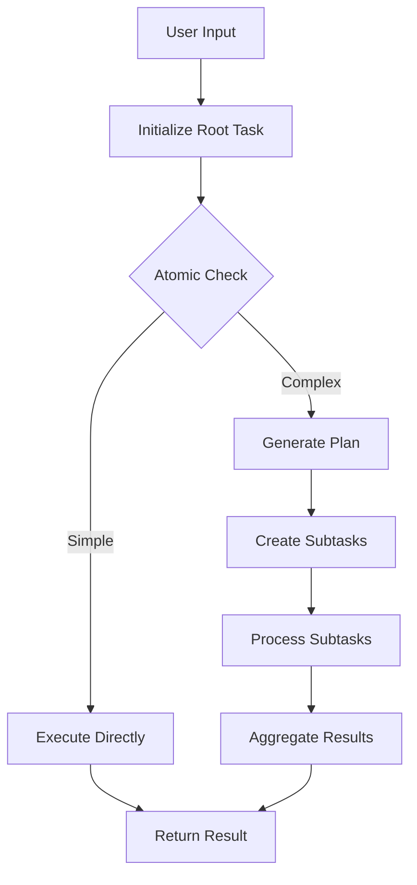
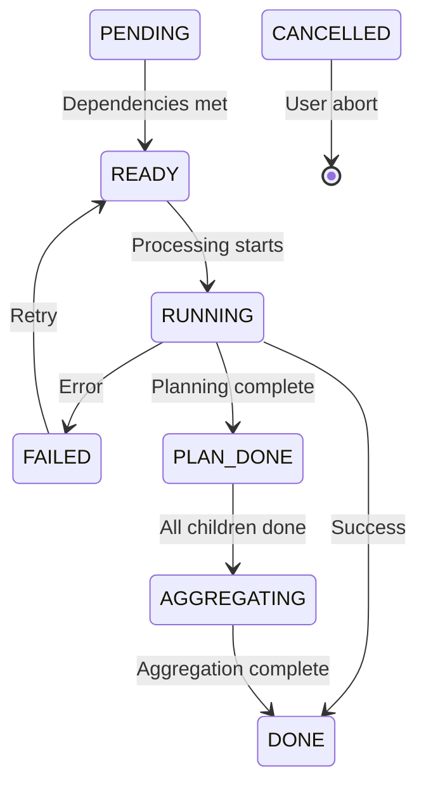

# 🔄 Execution Flow - Step by Step

This guide provides a detailed walkthrough of how SentientResearchAgent executes tasks from start to finish, including all decision points and data flows.

## 📋 Table of Contents

- [Overview](#-overview)
- [Phase 1: Initialization](#-phase-1-initialization)
- [Phase 2: Task Analysis](#-phase-2-task-analysis)
- [Phase 3: Planning](#-phase-3-planning)
- [Phase 4: Execution](#-phase-4-execution)
- [Phase 5: Aggregation](#-phase-5-aggregation)
- [Phase 6: Completion](#-phase-6-completion)
- [Execution Example](#-execution-example)
- [State Transitions](#-state-transitions)
- [Context Flow](#-context-flow)
- [Error Handling](#-error-handling)
- [Performance Optimizations](#-performance-optimizations)

## 🌐 Overview

The execution flow follows a hierarchical pattern:



## 🚀 Phase 1: Initialization

### Step 1.1: Receive User Input

```python
# User submits goal via API
POST /api/execute
{
  "goal": "Research and compare top 3 cloud providers",
  "profile": "deep_research_agent",
  "config": {
    "max_depth": 3,
    "enable_caching": true
  }
}
```

### Step 1.2: Create Root Task Node

```python
# System creates root node
root_node = TaskNode(
    task_id="root",
    goal="Research and compare top 3 cloud providers",
    task_type=TaskType.WRITE,  # Determined by initial analysis
    node_type=NodeType.PLAN,    # Root typically starts as PLAN
    layer=0,
    status=TaskStatus.PENDING
)
```

### Step 1.3: Initialize Execution Context

```python
# Set up execution environment
execution_context = {
    "execution_id": "exec_123",
    "project_id": "proj_456",
    "profile": "deep_research_agent",
    "start_time": datetime.now(),
    "config": config
}

# Initialize core components
task_graph = TaskGraph()
knowledge_store = KnowledgeStore()
execution_engine = ExecutionEngine(...)
```

### Step 1.4: WebSocket Connection

```javascript
// Frontend connects for real-time updates
socket.on('connect', () => {
  socket.emit('start_execution', { execution_id: 'exec_123' });
});

socket.on('task_update', (update) => {
  updateVisualization(update);
});
```

## 🔍 Phase 2: Task Analysis

### Step 2.1: Status Check

```python
# StateTransitionManager checks if node can proceed
def can_transition_to_ready(node):
    # Check dependencies
    if node.parent_node_id:
        parent = get_node(node.parent_node_id)
        if parent.status != TaskStatus.PLAN_DONE:
            return False
    
    # Check siblings if sequential
    for dep in node.dependencies:
        if get_node(dep).status != TaskStatus.DONE:
            return False
    
    return True
```

### Step 2.2: Transition to READY

```python
# Node becomes ready for processing
if can_transition_to_ready(root_node):
    root_node.update_status(TaskStatus.READY)
    emit_update('task_ready', root_node)
```

### Step 2.3: Node Processing Begins

```python
# NodeProcessor takes over
async def process_node(node: TaskNode):
    node.update_status(TaskStatus.RUNNING)
    
    # Determine processing path
    if node.node_type == NodeType.PLAN:
        return await process_plan_node(node)
    else:
        return await process_execute_node(node)
```

## 📋 Phase 3: Planning

### Step 3.1: Atomization Check

```python
# Check if task needs decomposition
atomizer_input = AtomizerInput(
    task=node,
    context=build_context(node)
)

atomizer_result = await atomizer_agent.process(atomizer_input)
# Result: { "is_atomic": false, "reasoning": "Too complex..." }
```

### Step 3.2: HITL Plan Review (Optional)

```python
if config.enable_hitl and config.hitl_after_atomizer:
    hitl_response = await request_human_review(
        checkpoint="atomization",
        node=node,
        decision=atomizer_result
    )
    
    if hitl_response.action == "modify":
        # Adjust based on human input
        node.node_type = NodeType.EXECUTE
```

### Step 3.3: Plan Generation

```python
# Select appropriate planner
planner = agent_selector.get_planner(node.task_type)

# Build planning context
planner_input = PlannerInput(
    goal=node.goal,
    task_type=node.task_type,
    relevant_context=gather_relevant_results(node),
    constraints=get_constraints(node)
)

# Generate plan
plan_output = await planner.generate_plan(planner_input)
```

### Step 3.4: Plan Structure

```json
{
  "subtasks": [
    {
      "goal": "Research AWS services and pricing",
      "task_type": "SEARCH",
      "node_type": "EXECUTE",
      "dependencies": []
    },
    {
      "goal": "Research Azure services and pricing",
      "task_type": "SEARCH", 
      "node_type": "EXECUTE",
      "dependencies": []
    },
    {
      "goal": "Research GCP services and pricing",
      "task_type": "SEARCH",
      "node_type": "EXECUTE",
      "dependencies": []
    },
    {
      "goal": "Create comparison matrix",
      "task_type": "THINK",
      "node_type": "EXECUTE",
      "dependencies": ["root.1", "root.2", "root.3"]
    },
    {
      "goal": "Write comprehensive comparison report",
      "task_type": "WRITE",
      "node_type": "EXECUTE",
      "dependencies": ["root.4"]
    }
  ],
  "reasoning": "Parallel research followed by analysis and report"
}
```

### Step 3.5: Create Sub-Graph

```python
# Create sub-graph for subtasks
sub_graph = TaskGraph(graph_id=f"subgraph_{node.task_id}")

for i, subtask_spec in enumerate(plan_output.subtasks):
    subtask = TaskNode(
        task_id=f"{node.task_id}.{i+1}",
        goal=subtask_spec.goal,
        task_type=subtask_spec.task_type,
        node_type=subtask_spec.node_type,
        layer=node.layer + 1,
        parent_node_id=node.task_id,
        status=TaskStatus.PENDING
    )
    
    sub_graph.add_node(subtask)
    
    # Add dependencies
    for dep in subtask_spec.dependencies:
        sub_graph.add_edge(dep, subtask.task_id)

# Link to parent
node.sub_graph_id = sub_graph.graph_id
node.planned_sub_task_ids = [n.task_id for n in sub_graph.nodes]
node.update_status(TaskStatus.PLAN_DONE)
```

## ⚡ Phase 4: Execution

### Step 4.1: Parallel Task Scheduling

```python
# TaskScheduler identifies ready tasks
ready_tasks = []
for task in sub_graph.nodes:
    if task.status == TaskStatus.PENDING:
        if all_dependencies_complete(task):
            task.update_status(TaskStatus.READY)
            ready_tasks.append(task)

# Process in parallel up to limit
concurrent_limit = config.max_concurrent_nodes
active_tasks = []

for task in ready_tasks[:concurrent_limit]:
    active_tasks.append(
        asyncio.create_task(process_node(task))
    )
```

### Step 4.2: Execute Individual Tasks

```python
async def process_execute_node(node: TaskNode):
    # Build execution context
    context = ContextBuilder.build_for_node(
        node=node,
        knowledge_store=knowledge_store,
        include_siblings=True,
        include_lineage=True
    )
    
    # Select executor
    executor = agent_selector.get_executor(
        task_type=node.task_type,
        profile=current_profile
    )
    
    # Execute with monitoring
    try:
        result = await executor.execute(
            task=node,
            context=context
        )
        
        # Store result
        knowledge_store.store_result(
            node_id=node.task_id,
            result=result,
            summary=generate_summary(result)
        )
        
        node.result = result
        node.update_status(TaskStatus.DONE)
        
    except Exception as e:
        node.error = str(e)
        node.update_status(TaskStatus.FAILED)
        
        # Attempt recovery
        if recovery_manager.can_recover(node, e):
            await recovery_manager.recover(node)
```

### Step 4.3: Real-time Updates

```python
# Broadcast updates via WebSocket
def emit_task_update(node: TaskNode):
    update = {
        "type": "task_update",
        "timestamp": datetime.now().isoformat(),
        "node": node.to_dict(),
        "graph": task_graph.to_dict(),
        "execution_id": execution_context["execution_id"]
    }
    
    socketio.emit('task_update', update)
```

### Step 4.4: Context Building for Tasks

```python
# Example context for "Create comparison matrix" task
context = {
    "task": {
        "id": "root.4",
        "goal": "Create comparison matrix"
    },
    "sibling_results": [
        {
            "task_id": "root.1",
            "summary": "AWS: 200+ services, pay-as-you-go...",
            "result": { /* full AWS research */ }
        },
        {
            "task_id": "root.2", 
            "summary": "Azure: Strong enterprise integration...",
            "result": { /* full Azure research */ }
        },
        {
            "task_id": "root.3",
            "summary": "GCP: Best for ML/AI workloads...",
            "result": { /* full GCP research */ }
        }
    ],
    "parent_context": {
        "goal": "Research and compare top 3 cloud providers",
        "requirements": ["pricing", "services", "strengths"]
    }
}
```

## 📊 Phase 5: Aggregation

### Step 5.1: Check Subtask Completion

```python
def check_subtasks_complete(parent_node):
    sub_graph = get_sub_graph(parent_node.sub_graph_id)
    
    for task_id in parent_node.planned_sub_task_ids:
        task = sub_graph.get_node(task_id)
        if task.status not in [TaskStatus.DONE, TaskStatus.FAILED]:
            return False
    
    return True
```

### Step 5.2: Trigger Aggregation

```python
if check_subtasks_complete(root_node):
    root_node.update_status(TaskStatus.AGGREGATING)
    
    # Collect all child results
    child_results = []
    for task_id in root_node.planned_sub_task_ids:
        task = sub_graph.get_node(task_id)
        if task.status == TaskStatus.DONE:
            child_results.append({
                "task_id": task.task_id,
                "goal": task.goal,
                "result": task.result,
                "summary": task.output_summary
            })
```

### Step 5.3: Aggregate Results

```python
# Select aggregator
aggregator = agent_selector.get_aggregator(
    task_type=root_node.task_type,
    profile=current_profile
)

# Build aggregation input
aggregator_input = AggregatorInput(
    original_goal=root_node.goal,
    child_results=child_results,
    execution_strategy="parallel_then_sequential",
    synthesis_requirements=["comprehensive", "actionable"]
)

# Generate final result
final_result = await aggregator.aggregate(aggregator_input)
```

### Step 5.4: Store Final Result

```python
# Update root node
root_node.result = final_result
root_node.output_summary = generate_executive_summary(final_result)
root_node.update_status(TaskStatus.DONE)
root_node.timestamp_completed = datetime.now()

# Store in knowledge store
knowledge_store.store_result(
    node_id=root_node.task_id,
    result=final_result,
    metadata={
        "execution_time": calculate_total_time(),
        "tokens_used": calculate_token_usage(),
        "subtasks_completed": len(child_results)
    }
)
```

## ✅ Phase 6: Completion

### Step 6.1: Final Updates

```python
# Send completion notification
socketio.emit('execution_complete', {
    "execution_id": execution_context["execution_id"],
    "status": "success",
    "result": root_node.result,
    "summary": root_node.output_summary,
    "execution_time": total_time,
    "task_tree": task_graph.to_dict()
})
```

### Step 6.2: Save Execution Trace

```python
# Save detailed trace for analysis
trace = {
    "execution_id": execution_context["execution_id"],
    "start_time": execution_context["start_time"],
    "end_time": datetime.now(),
    "root_goal": root_node.goal,
    "profile_used": execution_context["profile"],
    "task_tree": task_graph.to_detailed_dict(),
    "all_results": knowledge_store.get_all_results(),
    "metrics": {
        "total_tasks": count_all_tasks(),
        "successful_tasks": count_successful_tasks(),
        "failed_tasks": count_failed_tasks(),
        "total_tokens": calculate_token_usage(),
        "execution_time": total_time
    }
}

save_trace(trace)
```

### Step 6.3: Cleanup

```python
# Optional cleanup
if config.cleanup_after_execution:
    # Clear temporary data
    knowledge_store.clear_execution_data(execution_id)
    
    # Archive if needed
    if config.archive_executions:
        archive_execution(execution_context)
```

## 📚 Execution Example

Let's trace through a real example:

### User Input
```
"Explain how photosynthesis works for a 10-year-old"
```

### Execution Trace

```
1. CREATE ROOT NODE
   - ID: root
   - Goal: "Explain how photosynthesis works for a 10-year-old"
   - Type: WRITE
   - Status: PENDING → READY

2. ATOMIZATION CHECK
   - Decision: NOT ATOMIC (needs planning)
   - Reasoning: "Complex explanation requiring multiple concepts"

3. GENERATE PLAN
   Subtasks:
   - root.1: "Research simple explanations of photosynthesis"
   - root.2: "Find age-appropriate analogies"
   - root.3: "Create engaging explanation with examples"

4. EXECUTE SUBTASKS
   [Parallel]
   - root.1: SEARCH → "Plants are like tiny factories..."
   - root.2: THINK → "Kitchen/cooking analogy works well..."
   
   [Sequential]
   - root.3: WRITE → "Imagine plants are like magical cooks..."

5. AGGREGATE RESULTS
   - Combine research and analogies
   - Create cohesive explanation
   - Add fun facts and visual descriptions

6. FINAL RESULT
   "Let me tell you about the amazing way plants make their own food!
    Imagine plants are like magical cooks in a kitchen..."
```

## 🔀 State Transitions

### Valid Transitions



### Transition Rules

```python
VALID_TRANSITIONS = {
    TaskStatus.PENDING: [TaskStatus.READY, TaskStatus.CANCELLED],
    TaskStatus.READY: [TaskStatus.RUNNING, TaskStatus.CANCELLED],
    TaskStatus.RUNNING: [TaskStatus.DONE, TaskStatus.FAILED, 
                         TaskStatus.PLAN_DONE, TaskStatus.CANCELLED],
    TaskStatus.PLAN_DONE: [TaskStatus.AGGREGATING, TaskStatus.FAILED],
    TaskStatus.AGGREGATING: [TaskStatus.DONE, TaskStatus.FAILED],
    TaskStatus.DONE: [],  # Terminal state
    TaskStatus.FAILED: [TaskStatus.READY],  # For retry
    TaskStatus.CANCELLED: []  # Terminal state
}
```

## 🔗 Context Flow

### Context Hierarchy

```
Global Context
├── Execution Context
│   ├── Profile Settings
│   ├── User Preferences
│   └── System Configuration
├── Task Context
│   ├── Parent Context
│   ├── Sibling Results
│   └── Task-Specific Data
└── Agent Context
    ├── Agent Configuration
    ├── Model Settings
    └── Tool Access
```

### Context Building Example

```python
def build_context_for_task(task: TaskNode) -> Dict:
    context = {
        # Global context
        "execution_id": current_execution_id,
        "timestamp": datetime.now(),
        
        # Lineage context
        "overall_objective": get_root_goal(),
        "parent_goal": get_parent_goal(task),
        "task_depth": task.layer,
        
        # Sibling context
        "sibling_results": get_completed_sibling_results(task),
        
        # Relevant prior results
        "relevant_context": knowledge_store.get_relevant_results(
            task_goal=task.goal,
            limit=5,
            similarity_threshold=0.7
        ),
        
        # Constraints and preferences
        "constraints": get_active_constraints(),
        "user_preferences": get_user_preferences()
    }
    
    return context
```

## 🚨 Error Handling

### Error Types and Recovery

```python
ERROR_RECOVERY_STRATEGIES = {
    "RateLimitError": {
        "strategy": "exponential_backoff",
        "max_retries": 3,
        "initial_delay": 60
    },
    "NetworkError": {
        "strategy": "immediate_retry",
        "max_retries": 2
    },
    "ParseError": {
        "strategy": "reformulate_prompt",
        "max_retries": 1
    },
    "TimeoutError": {
        "strategy": "reduce_scope",
        "max_retries": 1
    }
}
```

### Recovery Flow

```python
async def handle_task_failure(task: TaskNode, error: Exception):
    # Log error
    logger.error(f"Task {task.task_id} failed: {error}")
    
    # Check recovery strategy
    strategy = ERROR_RECOVERY_STRATEGIES.get(
        type(error).__name__,
        {"strategy": "fail", "max_retries": 0}
    )
    
    if task.retry_count < strategy["max_retries"]:
        # Apply recovery strategy
        if strategy["strategy"] == "exponential_backoff":
            delay = strategy["initial_delay"] * (2 ** task.retry_count)
            await asyncio.sleep(delay)
        
        # Retry task
        task.retry_count += 1
        task.update_status(TaskStatus.READY)
        await process_node(task)
    else:
        # Mark as permanently failed
        task.update_status(TaskStatus.FAILED)
        task.error = f"Failed after {task.retry_count} retries: {error}"
        
        # Notify parent
        propagate_failure(task)
```

## ⚡ Performance Optimizations

### 1. Parallel Execution

```python
# Identify parallelizable tasks
parallel_groups = identify_parallel_groups(task_graph)

# Execute each group concurrently
for group in parallel_groups:
    await asyncio.gather(*[
        process_node(task) for task in group
    ])
```

### 2. Result Caching

```python
# Check cache before executing
cache_key = generate_cache_key(task)
cached_result = cache_manager.get(cache_key)

if cached_result and not is_stale(cached_result):
    task.result = cached_result
    task.update_status(TaskStatus.DONE)
    return cached_result
```

### 3. Context Optimization

```python
# Summarize large contexts
if get_context_size(context) > MAX_CONTEXT_SIZE:
    context = summarize_context(
        context,
        preserve_keys=["goal", "constraints"],
        summarize_keys=["sibling_results", "relevant_context"]
    )
```

### 4. Batched Updates

```python
# Batch WebSocket updates
update_buffer = []
update_timer = None

def buffer_update(update):
    update_buffer.append(update)
    
    if len(update_buffer) >= BATCH_SIZE:
        flush_updates()
    elif not update_timer:
        update_timer = asyncio.create_task(
            flush_after_delay(BATCH_TIMEOUT)
        )
```

## 🎯 Key Takeaways

1. **Hierarchical Processing**: Tasks decompose recursively until atomic
2. **Parallel Execution**: Independent tasks run concurrently
3. **Context Preservation**: Information flows through the hierarchy
4. **Error Recovery**: Multiple strategies for different failure types
5. **Real-time Updates**: WebSocket provides live execution visibility
6. **Performance**: Caching, batching, and parallelization optimize speed

Understanding this flow enables you to:
- Debug execution issues
- Optimize performance
- Customize behavior
- Build advanced workflows

---

## 📚 Related Documentation

- [Core Concepts](CORE_CONCEPTS.md) - Fundamental concepts
- [Architecture](ARCHITECTURE.md) - System design
- [API Reference](API_REFERENCE.md) - API endpoints
- [Configuration](CONFIGURATION.md) - Tuning execution